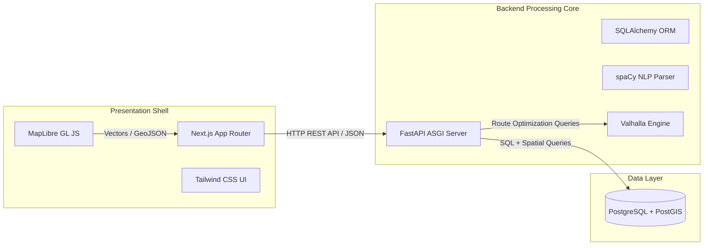
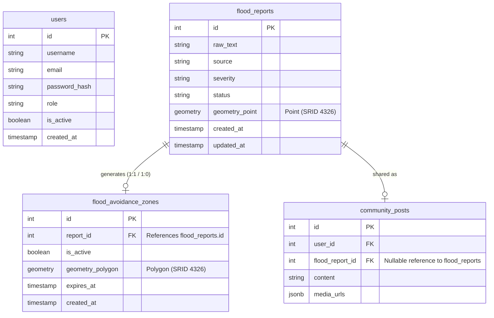
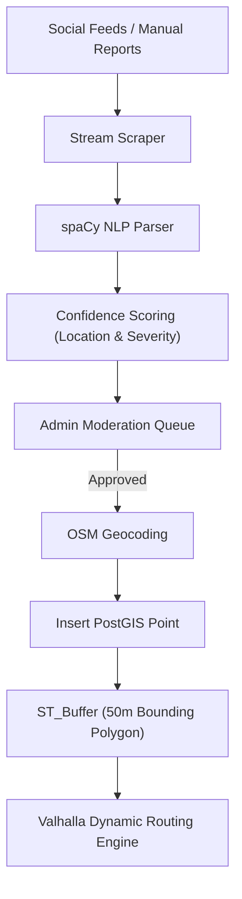

# LANES: System Architecture & Boundaries

> [!IMPORTANT]  
> This document defines the strict architectural boundaries for LANES. **Execution constraints and commands are located in `AGENTS.md` and `.agents/skills/`.** Do not duplicate rules; follow the skills for implementation details.

## 1. High-Level Architecture (Three-Tier Decoupled)

The platform isolates client-side rendering from resource-intensive spatial computations and NLP tokenization.

### Constraints:
- **Frontend (`/frontend`)**: Next.js + MapLibre + Tailwind. Purely a stateless presentation shell. **No business logic or direct DB access allowed.**
- **Backend (`/backend`)**: Python + FastAPI + PostGIS. Handles all tokenization, geocoding, and route calculation. **MUST follow a strict Service-Based (Layered/N-Tier) architecture** separating `api/`, `services/`, and `crud/` layers to allow shared spatial utilities across endpoints.

---

## 2. Core Database Schema

The data tier is engineered using PostgreSQL + PostGIS. 

### Constraints:
- **Strict 3NF Compliance**: All new tables and schema modifications MUST strictly follow Third Normal Form (3NF). Eliminate partial and transitive dependencies.
- **Scraping Metadata**: Use `JSONB` for unstructured external payloads.
- **Spatial Queries**: Use native PostGIS triggers (`ST_Intersects`, `ST_Buffer`) and ensure `GIST` indexes are applied. `SRID 4326` is the default.

---

## 3. Spatial Data Pipeline

Transforms digital community reports into active geospatial barriers across three computational phases.

### Constraints:
- NLP parsed text MUST be scored (`location_confidence`, `severity_confidence`) before entering the moderation queue.
- Valhalla dynamically avoids paths intersecting with active bounding polygons.

---

## 4. UI & Security Boundaries

### UI Constraints (Frontend):
- **Tailwind Only**: Use Tailwind utility classes for all styling. Avoid inline styles.
- **Illustrated Minimalism**: The map is the primary UI. Avoid heavy animations or visual noise that blocks spatial data.
- **Component Separation (Feature-Based Architecture)**: The frontend MUST follow a strict Feature-Based Architecture (Domain-driven structure). Group all domain-specific logic, components, state, and API hooks inside `src/features/` (e.g., `src/features/map`, `src/features/auth`) rather than purely by technical file type. Global shared resources remain in top-level `components/` or `hooks/`.

### Security Constraints (Backend):
- **JWT Auth Flow**: All protected resources must enforce `Depends(get_current_user)` checks in FastAPI.
- **Idempotency**: Seeder scripts must use `ON CONFLICT DO NOTHING`.
- **Role Isolation**: Admin APIs must verify `role == 'admin'` to prevent IDOR and unauthorized moderation.
