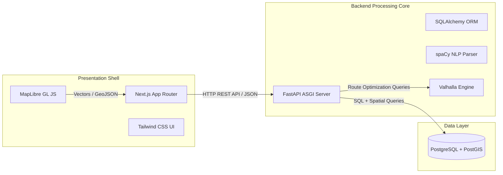
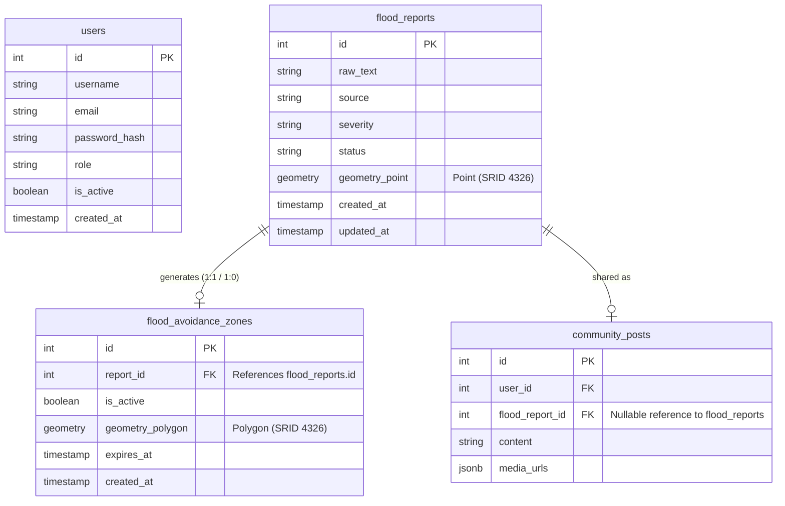
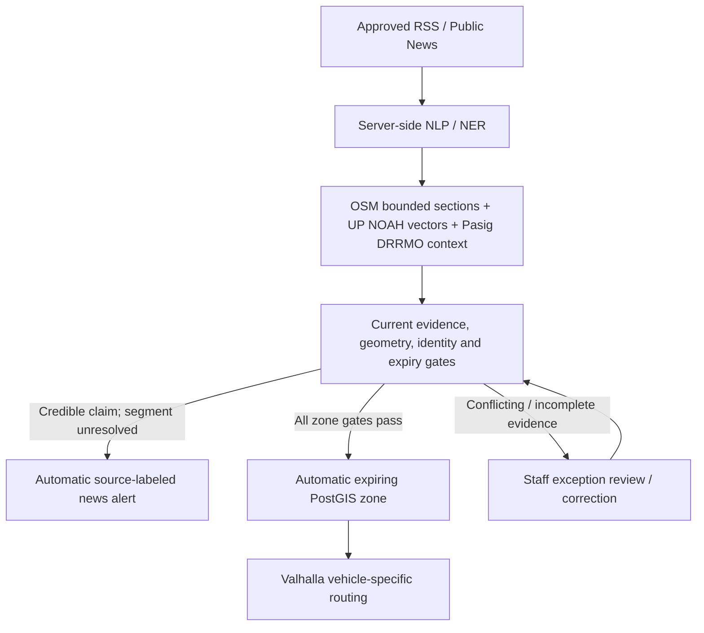

# LANES: System Architecture & Boundaries

> [!IMPORTANT]  
> This document defines the strict architectural boundaries for LANES. **Execution constraints and commands are located in `AGENTS.md` and `.agents/skills/`.** Do not duplicate rules; follow the skills for implementation details.

## 1. High-Level Architecture (Three-Tier Decoupled)

The platform isolates client-side rendering from resource-intensive spatial computations and NLP tokenization.

```mermaid
graph LR
    subgraph Client Tier [Presentation Shell]
        NextJS[Next.js App Router]
        Tailwind[Tailwind CSS UI]
        MapLibre[MapLibre GL JS]
    end

    subgraph Service Tier [Backend Processing Core]
        FastAPI[FastAPI ASGI Server]
        SQLAlchemy[SQLAlchemy ORM]
        spaCy[spaCy NLP Parser]
        Valhalla[Valhalla Engine]
    end

    subgraph Persistence Tier [Data Layer]
        PostGIS[(PostgreSQL + PostGIS)]
    end

    NextJS -- HTTP REST API / JSON --> FastAPI
    MapLibre -- Vectors / GeoJSON --> NextJS
    FastAPI -- SQL + Spatial Queries --> PostGIS
    FastAPI -- Route Optimization Queries --> Valhalla
```

### Constraints:
- **Frontend (`/frontend`)**: Next.js + MapLibre + Tailwind. Purely a stateless presentation shell. **No business logic or direct DB access allowed.**
- **Backend (`/backend`)**: Python + FastAPI + PostGIS. Handles all tokenization, geocoding, and route calculation. **MUST follow a strict Service-Based (Layered/N-Tier) architecture** separating `api/`, `services/`, and `crud/` layers to allow shared spatial utilities across endpoints.

---

## 2. Core Database Schema

The data tier is engineered using PostgreSQL + PostGIS. 

```mermaid
erDiagram
    users {
        int id PK
        string username
        string email
        string password_hash
        string role
        boolean is_active
        timestamp created_at
    }

    flood_reports {
        int id PK
        string raw_text
        string source
        string severity
        string status
        geometry geometry_point "Point (SRID 4326)"
        timestamp created_at
        timestamp updated_at
    }

    flood_avoidance_zones {
        int id PK
        int report_id FK "References flood_reports.id"
        boolean is_active
        geometry geometry_polygon "Polygon (SRID 4326)"
        timestamp expires_at
        timestamp created_at
    }

    community_posts {
        int id PK
        int user_id FK
        int flood_report_id FK "Nullable reference to flood_reports"
        string content
        jsonb media_urls
    }

    flood_reports ||--o| flood_avoidance_zones : "generates (1:1 / 1:0)"
    flood_reports ||--o| community_posts : "shared as"
```

### Constraints:
- **Strict 3NF Compliance**: All new tables and schema modifications MUST strictly follow Third Normal Form (3NF). Eliminate partial and transitive dependencies.
- **Scraping Metadata**: Use `JSONB` for unstructured external payloads.
- **Spatial Queries**: Use native PostGIS triggers (`ST_Intersects`, `ST_Buffer`) and ensure `GIST` indexes are applied. `SRID 4326` is the default.

---

## 3. Spatial Data Pipeline

The news pipeline targets automatic discovery, extraction, placement and gated zone activation. Bounded OSM/NOAH/Pasig DRRMO modeled placement previews, independent evidence auditing and automatic text-only source alerts are implemented locally, including qualified observation refresh, matched clearance, two-hour evidence expiry and staff/public interfaces. Operational flood-zone activation and routing remain gated by verified current affected geometry and release acceptance; modeled susceptibility and administrative boundaries do not establish that footprint. The flow below includes this remaining operational-zone target. Citizen-report moderation keeps its existing staff approval workflow. See the [current lifecycle verification](docs/evaluations/phase-36-news-publication-lifecycle.md).

```mermaid
flowchart TD
    In[Approved RSS / Public News] --> NLP["Server-side NLP / NER"]
    NLP --> Placement["OSM bounded sections + UP NOAH vectors + Pasig DRRMO context"]
    Placement --> Gates["Current evidence, geometry, identity and expiry gates"]
    Gates -- "Credible claim; segment unresolved" --> Alert["Automatic source-labeled news alert"]
    Gates -- "All zone gates pass" --> Zone["Automatic expiring PostGIS zone"]
    Gates -- "Conflicting / incomplete evidence" --> Exceptions["Staff exception review / correction"]
    Exceptions --> Gates
    Zone --> Router["Valhalla vehicle-specific routing"]
```

### Constraints:
- Routine eligible news claims do not wait for staff approval. Staff handles conflicting or incomplete claims and corrections.
- Use current article evidence for current flood status; UP NOAH modeled susceptibility and Pasig DRRMO historical records support placement, not live flood confirmation. Apply Pasig history only to matching Pasig locations.
- OSM supplies bounded road geometry. Ranking scores, generic points and arbitrary 50 m buffers cannot establish verified affected geometry; unresolved alerts do not change routing.
- Backend-owned checks and idempotent lifecycle writes govern publication, linked zones, correction and expiry. Valhalla uses active verified zone geometry under the existing vehicle-specific policy.

---

## 4. UI & Security Boundaries

### UI Constraints (Frontend):
- **Tailwind Only**: Use Tailwind utility classes for all styling. Avoid inline styles.
- **Illustrated Minimalism**: The map is the primary UI. Avoid heavy animations or visual noise that blocks spatial data.
- **Component Separation (Feature-Based Architecture)**: The frontend MUST follow a strict Feature-Based Architecture (Domain-driven structure). Group all domain-specific logic, components, state, and API hooks inside `src/features/` (e.g., `src/features/map`, `src/features/auth`) rather than purely by technical file type. Global shared resources remain in top-level `components/` or `hooks/`.

### Security Constraints (Backend):
- **JWT Auth Flow**: All protected resources must enforce `Depends(get_current_user)` checks in FastAPI.
- **Idempotency**: Seeder scripts must use `ON CONFLICT DO NOTHING`.
- **Role Isolation**: Admin APIs must verify `role == 'admin'` to prevent IDOR and unauthorized moderation.
