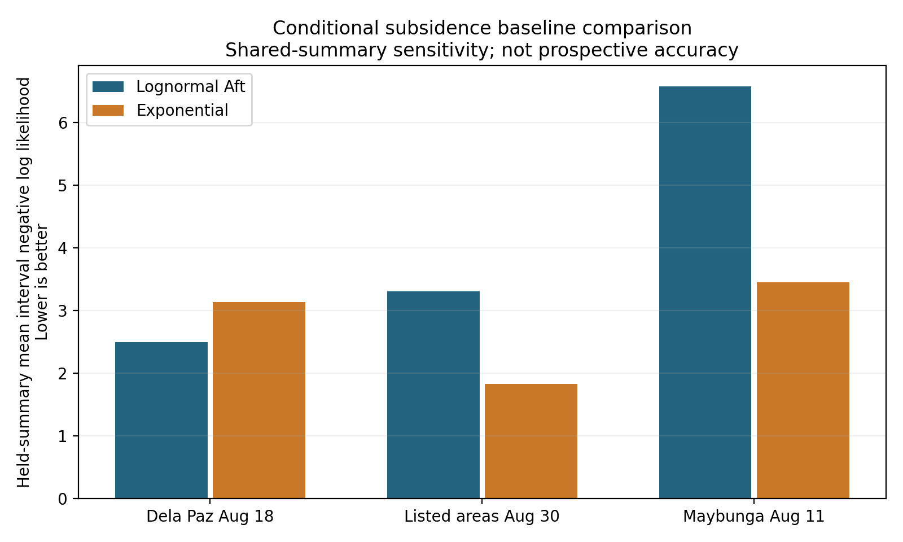

# Pasig subsidence model validation

> **Last Updated:** October 07, 2026, 09:34 PM by [@roicambe](https://github.com/roicambe) (Roi Cambe)

The conditional research fit is reproducible and its numerical/staff API contracts pass. This continuation adds a one-parameter exponential comparator and grouped evaluation tooling; it does not release automatic subsidence predictions or change expiry.

## Evidence and result

The source-verified candidate reconstruction reproduces all **37 projections**, their CSV bytes and the original lognormal fitted parameters (absolute tolerance 1e-6). These projections share **three subsidence summaries**, with **zero verified independent storm groups**. The newer reviewed capture overlay contributes **zero matched subsidence-duration pairs**. Original datasets and the packaged research model remain byte-for-byte unchanged.

| Held-out summary | Lognormal interval NLL | Exponential interval NLL |
| --- | ---: | ---: |
| Dela Paz August 18 | 2.489 | 3.134 |
| Listed areas August 30 | 3.304 | 1.821 |
| Maybunga August 11 | 6.575 | 3.448 |
| Equal-summary mean | **4.123** | **2.801** |

Lower interval negative log likelihood (NLL) is better. The exponential model scores better in two of three folds and overall. This is conditional summary sensitivity under the original unverified continuity/collective-scope assumptions, not proof of independent-storm generalization, calibrated probabilities or prospective accuracy. No midpoint labels or minute-level MAE are invented. The simpler comparator has a constant hazard; neither model learns rainfall, drainage, depth or location effects here. Keep both as research candidates rather than promoting the fitted lognormal by default.



Each entire shared outcome is held out from training. Each training summary contributes total weight one, and fold scores are averaged equally across summaries. Thirty-seven random row splits would allow shared outcomes into both training and evaluation. [Grouped validation guidance](https://scikit-learn.org/stable/modules/cross_validation.html#cross-validation-iterators-for-grouped-data). Interval bounds are retained in likelihood calculations, consistent with [AFT ranged-label modeling](https://xgboost.readthedocs.io/en/latest/tutorials/aft_survival_analysis.html).

The feature audit finds numeric depth in 36 candidate projections, but **zero verified pre-issuance availability records** and **zero verified episode continuity records**. Numeric depth alone does not qualify a feature model. Two projections first occur inside their subsidence article; no historical availability or independent event labels are created by this evaluation.

## Verification

**89 checks pass, zero failures/errors/skips:** 45 duration numerical/comparator checks, 17 duration API/service checks and 27 existing settings/pipeline regressions. Synthetic tests establish implementation correctness only. Coverage includes exact/left/right/interval likelihoods against independent SciPy distributions, extreme-tail precision, conditional remaining-time quantiles, horizon survival ratios, known synthetic MLE and feature coefficients, invalid/rank-deficient training, invalid artifacts, checksum pins, shared-summary weights, authentication before artifact access, actual application route registration, research-only responses, geography/time abstention, request validation and sanitized 503 errors.

The API requests use an isolated FastAPI router with actual authentication/permission dependencies; actual application route registration is also checked. They do not establish deployed HTTP or browser acceptance. Two pre-existing warnings concern python_multipart and a separate model_admitted protected namespace. An initial test setup used an oversized byte payload as a pytest ID, exceeding Windows temporary-path limits; explicit short IDs fix the harness. Both malformed and oversized artifact cases remain tested.

Reproduce from `backend`:

```powershell
.\venv\Scripts\python.exe -X utf8 -m scripts.evaluate_pasig_duration --output ../docs/evaluations/pasig-subsidence-validation-20261007
.\venv\Scripts\python.exe -X utf8 -m pytest tests/test_flood_duration_model.py tests/test_flood_duration_api.py tests/test_operational_settings.py tests/test_news_pipeline.py -q --junitxml=../docs/evaluations/pasig-subsidence-validation-20261007/pytest-results.xml
```

[Evaluation report](evaluation_report.json), [per-fold comparison](held_summary_comparison.csv), [test verification](verification_report.json), [JUnit results](pytest-results.xml) and [vector figure](baseline_comparison.pdf) preserve actual results. Per-fold lognormal artifacts retain training/held-summary lineage. The evaluator rebuilds candidates in a temporary directory, verifies captured-source checksums and refuses changed inputs/parameters. Input/evaluator/output hashes are recorded. No new package, SQLAlchemy model, migration, UI or cloud configuration is introduced. Existing SciPy 1.14.1 and Matplotlib are declared in requirements. No database is opened or changed by the evaluator; numerical predictions cannot mutate operational status/expiry/routing.

## Next work in order

1. Verify the implemented owner/staff follow-up workflow end to end, including disposable database and mobile/desktop acceptance, then release it to collect prospective evidence. Its prior implementation is preserved; this continuation does not claim those remaining tests are complete.
2. Qualify matched wet/subsided observations with actual source availability, fixed prediction issuance, supported same road/episode and dependency/storm groups. Keep missing outcomes; right censoring needs affirmative supported wet follow-ups, not silence.
3. Fit feature-based AFT and compare with both simple baselines using only features available before issuance; evaluate on separate qualified storm groups, with interval-compatible scores and operational errors. Choose complexity from these results rather than a record-count rule.
4. Connect a case-bound research adapter and record predictions prospectively in shadow mode. Adopt release/abstention/adaptive-expiry policy only after acceptance. A predicted time never establishes observed Cleared status; the existing evidence expiry remains Unconfirmed.

## Authoritative documentation audit

| Record | Result for this continuation |
| --- | --- |
| progress.md | New local validation milestone; no operational-ML completion claim. |
| task_plan.md | Grouped comparison/test task complete; follow-up, feature, shadow and release gates remain open. |
| tech-stack.md | Existing declared SciPy/NumPy/Matplotlib suffice; no package added. |
| feature-reference.md | Existing module audit; no new flagship capability delivered. |
| decisions.md | No new architectural pivot; no entry added. |
| others/system-documentation.md | Duration API test status updated; existing routes/permission behavior unchanged. |
| others/database-design-plan.md | No model/schema/migration mutation; no migration write required for offline tooling/tests. |
| others/bug-log.md | No new application defect identified; Windows pytest ID issue is recorded above as a corrected harness limitation. |

[@roicambe](https://github.com/roicambe) (Roi Cambe)

## Senior-planner pre-push checkpoint

October 07, 2026, 09:39 PM, Asia/Manila — [@roicambe](https://github.com/roicambe) (Roi Cambe).

The user requests an update and push of the full working tree to `roi-branch`. The branch is `roi-branch`; fetching its remote confirms zero ahead/behind divergence before committing. All eight authoritative records are audited, with new delivery/backlog, stack, API test status and migration notes synchronized. Existing flagship and architectural-decision scope is retained. The missing nested follow-up search-note catalog link is added.

A fresh `python -m scripts.verify_settings_postgis` run passes **174 tests** (settings, news lifecycle and zone growth) after the existing migration chain in two disposable local databases; subsequent inspection finds zero generated settings/lifecycle databases. `alembic heads` reports `d7e4b9a21c60`. There are no model/migration definition changes. The latest separate focused run passes **89 ML/settings/pipeline tests**. The fresh frontend `npm run build` succeeds, including TypeScript and all 26 pages. Existing Python packages are declared; no Node package was added. This checkpoint does not rerun browser or actual follow-up runtime acceptance and does not convert those pending gates into delivery claims.

Git attributes preserve the byte identities used in source/model/test/evaluation checksums across Windows/Linux clones. Public research source captures and scientific figures are retained; local environments, caches, plaintext keys and generated build outputs remain excluded. Commit/push results are reported after Git completes; this record does not predeclare a successful push or deployment. Production settings/Scheduler release, live plotting, follow-up end-to-end/PWA acceptance and qualified prospective prediction remain open.
