# LANES Database Normalization & Security Architecture Plan

> **Last Updated:** September 22, 2026, 1:19 AM by [@roicambe](https://github.com/roicambe) (Roi Cambe)

This document details the normalized, secure database architecture designed for **LANES (Localised Alternative Navigation for Environs under Submersion)**. It serves as a comprehensive reference guide to PostgreSQL schema patterns, spatial indexing, table normalization (3NF), and security safeguards.

---

## 1. Architectural Entity Relationship Diagram (ERD)

```mermaid
erDiagram
    roles {
        int id PK "Auto-incrementing surrogate identifier"
        string name UK "Role name"
        jsonb permissions "JSON permissions matrix"
        boolean is_template "Template toggle"
        datetime created_at "UTC timestamp"
    }

    users {
        int id PK "Auto-incrementing surrogate identifier"
        string username UK "Admin/User identity handle"
        string email UK "Electronic mail address"
        string hashed_password "Salter bcrypt password hash"
        int role_id FK "Reference to roles"
        boolean is_active "Soft deactivation toggle"
        datetime created_at "UTC timestamp of registration"
        datetime deleted_at "Soft delete marker"
    }
    
    profiles {
        int id PK "Unique identifier"
        int user_id FK "Reference to users (UNIQUE)"
        string first_name
        string last_name
        string middle_initial
        string suffix
        string contact_number
        date birthdate
        string avatar_url
        boolean hide_profile_picture "Avatar privacy toggle"
        datetime updated_at
    }

    addresses {
        int id PK "Unique identifier"
        int profile_id FK "Reference to profiles (UNIQUE)"
        string house_number
        string street
        string barangay
        string city_municipality
        string province
        string postal_code
        string country
    }

    otp_verifications {
        int id PK "Unique identifier"
        string email
        string otp_code "Hashed OTP"
        datetime expires_at
        int attempts
        boolean is_verified
        datetime created_at
    }

    system_settings {
        string key PK "Setting key"
        jsonb value "Setting payload"
        int last_updated_by FK "Reference to users"
        datetime updated_at
    }

    flood_reports {
        int id PK "Unique identifier"
        int user_id FK "Nullable link to registered users.id"
        string raw_text "Raw bilingual Taglish input text"
        string source "Origin: twitter, facebook, user_report, manual_seeder"
        string source_url "Nullable URL link to the original article/post"
        string severity "Risk level: low, medium, high, extreme"
        string status "Moderation: pending, approved, rejected"
        int event_id FK "Nullable verified Flood Event reference"
        string image_url "Optional photo evidence"
        string human_readable_location "Normalized landmark"
        string barangay "Cleaned barangay name"
        string city "City or municipality"
        boolean is_public "Consent toggle for feed"
        geometry geometry "PostGIS Point coordinates (SRID 4326)"
        datetime created_at "UTC timestamp of ingestion"
        datetime updated_at "UTC timestamp of latest update"
        datetime deleted_at "Soft delete marker"
    }

    flood_report_locations {
        int id PK "Unique location entity identifier"
        int report_id FK "Cascade reference to flood_reports"
        string location_name "Normalized street or landmark name"
    }

    flood_avoidance_zones {
        int id PK "Unique detour zone identifier"
        int report_id FK "Cascade reference to flood_reports"
        geometry geometry "PostGIS Polygon boundaries (SRID 4326)"
        source_geometry geometry "Nullable original admin road centreline"
        boolean is_active "Status toggle for routing engine"
        int event_id FK "Nullable verified Flood Event reference"
        datetime created_at "UTC timestamp of generation"
        datetime updated_at "UTC timestamp of latest metadata update"
        datetime expires_at "Nullable UTC expiry limit"
    }

    flood_events {
        int id PK "Durable verified incident identifier"
        string status "active or ended"
        datetime first_reported_at "Nullable first linked report time"
        datetime verified_at "Official verification time"
        datetime ended_at "Nullable final-zone end time"
        string peak_severity "Highest verified severity"
        string peak_depth "Nullable highest verified water level"
    }

    flood_event_locations {
        int id PK "Normalized affected-place identifier"
        int event_id FK "Cascade reference to flood_events"
        string location_type "road, barangay, or city"
        string normalized_name "Per-event normalized place key"
    }

    flood_report_moderation_outcomes {
        int id PK "Append-only moderation outcome"
        int report_id FK "Cascade reference to flood_reports"
        int event_id FK "Nullable verified Flood Event reference"
        int zone_id FK "Nullable official zone reference"
        string outcome "approved, linked, or rejected"
    }

    flood_event_timeline_entries {
        int id PK "Readable incident-history entry"
        int event_id FK "Cascade reference to flood_events"
        string entry_type "Lifecycle event type"
        jsonb snapshot_json "Historical display snapshot, not a live relation"
        datetime occurred_at "UTC event timestamp"
    }

    audit_logs {
        int id PK "Append-only surrogate identifier"
        int admin_id FK "SET NULL reference to users"
        string action_type "Moderation action identifier"
        string target_table "Affected table metadata"
        int target_id "Affected record primary key"
        jsonb metadata_json "Diff properties stored in binary JSON"
        string ip_address "Origin IP (IPv4/IPv6)"
        datetime created_at "UTC action timestamp"
    }

    post_interactions {
        int id PK "Unique interaction identifier"
        int user_id FK "Reference to users"
        int report_id FK "Reference to flood_reports"
        string interaction_type "upvote, downvote"
        datetime created_at "UTC action timestamp"
    }

    comments {
        int id PK "Unique comment identifier"
        int user_id FK "Reference to users"
        int report_id FK "Reference to flood_reports"
        string content "Comment body"
        datetime created_at "UTC action timestamp"
    }

    flood_report_surveys {
        int id PK "Unique survey identifier"
        int report_id FK "Cascade reference to flood_reports (UNIQUE)"
        string passable_vehicles "Open text for vehicle types"
        string hidden_hazards "yes, no, unsure"
    }

    community_posts {
        int id PK "Unique post identifier"
        int user_id FK "Reference to users"
        int flood_report_id FK "Nullable reference to flood_reports"
        string content "Text content of the post"
        jsonb media_urls "Array of image/video URLs"
        string location_tag "Display landmark or location name"
        float location_lat "Latitude coordinate for map view"
        float location_lng "Longitude coordinate for map view"
        boolean is_pinned "Pin status toggle"
        datetime pinned_at "Timestamp of pinning"
        datetime created_at "UTC creation timestamp"
        datetime updated_at "UTC update timestamp"
        datetime hidden_at "Nullable moderation hide timestamp"
        int hidden_by_user_id FK "Nullable reference to users"
        datetime deleted_at "Nullable soft delete timestamp"
        int deleted_by_user_id FK "Nullable reference to users"
    }

    saved_places {
        int id PK "Unique identifier"
        int user_id FK "Cascade reference to users"
        string name "Custom waypoint label"
        string icon "Emoji representation"
        string address "Human-readable address"
        float latitude "Explicit WGS84 latitude"
        float longitude "Explicit WGS84 longitude"
        int pin_order "Custom ordering slot"
        geometry geometry "Point (SRID 4326)"
        datetime created_at "UTC timestamp"
    }

    notifications {
        int id PK "Unique notification identifier"
        int user_id FK "Reference to users"
        string type "LIKE, COMMENT, SYSTEM"
        string message "Notification text"
        jsonb payload "Routing metadata"
        boolean is_read "Read status toggle"
        datetime created_at "UTC creation timestamp"
    }

    roles ||--o{ users : "assigns"
    users ||--o| profiles : "has"
    profiles ||--o| addresses : "has"
    users ||--o{ audit_logs : "creates"
    users ||--o{ flood_reports : "submits"
    users ||--o{ post_interactions : "interacts"
    users ||--o{ comments : "writes"
    users ||--o{ system_settings : "updates"
    users ||--o{ community_posts : "writes"
    users ||--o{ saved_places : "bookmarks"
    users ||--o{ notifications : "receives"
    flood_reports ||--o{ flood_report_locations : "maps to"
    flood_reports ||--o{ flood_avoidance_zones : "generates"
    flood_events ||--o{ flood_reports : "is supported by"
    flood_events ||--o{ flood_avoidance_zones : "owns"
    flood_events ||--o{ flood_event_locations : "affects"
    flood_events ||--o{ flood_event_timeline_entries : "records"
    flood_reports ||--o{ flood_report_moderation_outcomes : "receives"
    flood_reports ||--o| flood_report_surveys : "contains"
    flood_reports ||--o| community_posts : "shared as"
    community_posts ||--o{ post_interactions : "receives"
    community_posts ||--o{ comments : "receives"
```

---

## 2. Table-by-Table Data Dictionary

### Table A: `roles`
**Description:** Stores role templates and permissions for access control (RBAC).

| Attribute | Data Type | Constraints | Description |
| :--- | :--- | :--- | :--- |
| `id` | `INTEGER` | Primary Key | Unique surrogate key. |
| `name` | `VARCHAR(50)` | UNIQUE, NOT NULL, Index | Name of the role (e.g. admin, commuter). |
| `permissions` | `JSONB` | Default: `{}` | Detailed access matrix for sections. |
| `is_template` | `BOOLEAN` | Default: `FALSE` | Toggle indicating if it's a default template. |
| `created_at` | `TIMESTAMP` | Default: UTC Now | When the role was created. |

### Table B: `users`
**Description:** Stores account credentials and status flags for administrators and commuter clients.
**Security Level:** Critical.

| Attribute | Data Type | Constraints | Description & How it Works | Security / Performance Impact |
| :--- | :--- | :--- | :--- | :--- |
| `id` | `INTEGER` | Primary Key, Auto-increment | Unique surrogate key generated automatically for each user record. | Indexed by default. Keeps foreign key relations compact. |
| `username` | `VARCHAR(50)` | UNIQUE, NOT NULL, Index | Unique alphanumeric handle used by administrators and users to authenticate. | Indexed for fast login query performance. |
| `email` | `VARCHAR(100)` | UNIQUE, NOT NULL, Index | The primary electronic contact address of the account holder. | Indexed for account recovery checks and credential uniqueness. |
| `hashed_password` | `VARCHAR(255)` | NOT NULL | A secure one-way hash of the user's password generated using the **bcrypt** algorithm. | **Critical Security:** Never store plain text. Bcrypt adds a random salt and runs stretching loops to neutralize brute-force attacks. |
| `role_id` | `INTEGER` | Foreign Key, Index | Reference to `roles.id`. | Enforces Role-Based Access Control (RBAC) linking via the roles table. |
| `is_active` | `BOOLEAN` | Default: `TRUE` | Soft-deactivation toggle. Set to `FALSE` to suspend an account instead of deleting it. | Deactivated users are blocked from logging in, preserving historical records without losing referential integrity. |
| `deleted_at` | `TIMESTAMP` | Nullable | Soft-delete marker for the Archive Center. | Keeps the account structurally intact for historical audit logs, but fully removes access and visibility. |
| `created_at` | `TIMESTAMP` | Default: UTC Now | Record of when the account was initially created. | Used for registration auditing and chronological user reports. |

### Table C: `profiles`
**Description:** Stores personal and contact details attached to users.

| Attribute | Data Type | Constraints | Description |
| :--- | :--- | :--- | :--- |
| `id` | `INTEGER` | Primary Key | Profile identifier. |
| `user_id` | `INTEGER` | Foreign Key, UNIQUE, Index | One-to-one mapping to `users`. |
| `first_name` | `VARCHAR(100)` | NOT NULL | User's first name. |
| `last_name` | `VARCHAR(100)` | NOT NULL | User's last name. |
| `middle_initial` | `VARCHAR(10)` | Nullable | User's middle initial. |
| `suffix` | `VARCHAR(20)` | Nullable | e.g. Jr, Sr, III. |
| `contact_number` | `VARCHAR(20)` | Nullable | Phone number. |
| `birthdate` | `DATE` | Nullable | User's date of birth. |
| `avatar_url` | `VARCHAR(255)` | Nullable | Link to user avatar image. |
| `hide_profile_picture` | `BOOLEAN` | Default: `FALSE` | Privacy preference to hide avatar and display uppercase initial fallback. |
| `updated_at` | `TIMESTAMP` | Default: UTC Now | Last profile update. |

### Table D: `addresses`
**Description:** Stores physical location info for a profile.

| Attribute | Data Type | Constraints | Description |
| :--- | :--- | :--- | :--- |
| `id` | `INTEGER` | Primary Key | Address identifier. |
| `profile_id` | `INTEGER` | Foreign Key, UNIQUE, Index | One-to-one mapping to `profiles`. |
| `house_number` | `VARCHAR(100)` | Nullable | House/Unit string. |
| `street` | `VARCHAR(255)` | Nullable | Street name. |
| `barangay` | `VARCHAR(100)` | NOT NULL | Barangay. |
| `city_municipality` | `VARCHAR(100)` | NOT NULL | City or municipality. |
| `province` | `VARCHAR(100)` | NOT NULL | Province. |
| `postal_code` | `VARCHAR(20)` | Nullable | ZIP or postal code. |
| `country` | `VARCHAR(100)` | Default: 'Philippines' | Country name. |

### Table E: `otp_verifications`
**Description:** Temporary storage for email verifications and password resets.

| Attribute | Data Type | Constraints | Description |
| :--- | :--- | :--- | :--- |
| `id` | `INTEGER` | Primary Key | ID. |
| `email` | `VARCHAR(100)` | Index | Email requesting the OTP. |
| `otp_code` | `VARCHAR(255)` | NOT NULL | Hashed OTP code (bcrypt). |
| `expires_at` | `TIMESTAMP` | NOT NULL | Expiry threshold. |
| `attempts` | `INTEGER` | Default: 0 | Number of attempts used. |
| `is_verified` | `BOOLEAN` | Default: FALSE | Has the OTP been verified? |
| `created_at` | `TIMESTAMP` | Default: UTC Now | Timestamp of request. |

### Table F: `flood_reports`
**Description:** Stores processed Taglish flood alerts mined from social feeds or manual submissions.

| Attribute | Data Type | Constraints | Description & How it Works | Security / Performance Impact |
| :--- | :--- | :--- | :--- | :--- |
| `id` | `INTEGER` | Primary Key, Auto-increment | Unique identifier for each ingested report. | Acts as the primary key for spatial relations and active detour lookups. |
| `user_id` | `INTEGER` | Foreign Key (`ON DELETE SET NULL`), Index | References `users.id`. Nullable link representing the registered account that submitted the report. | Nullable. Allows tracing submitted reports back to web/mobile users for moderation, trust metrics, and block handling. |
| `raw_text` | `TEXT` | NOT NULL | The original, unmodified social media post, emergency feed, or user message. | Kept for review and debugging NLP parsing algorithms. |
| `source` | `VARCHAR(50)` | NOT NULL | Origin channel of the report (e.g., `'twitter'`, `'facebook'`, `'direct_user'`, `'manual_seeder'`). | Allows analytics regarding data feed trust and channel frequency. |
| `source_url` | `VARCHAR(500)` | Nullable | Original URL link referencing the web article, social post, or feed bulletin. | **Fact-checking & Future AI:** Enables operators to click and verify raw sources. Will be used by the future AI model as citation references. |
| `image_url` | `VARCHAR(500)` | Nullable | Uploaded photo evidence URL. | Provides visual verification of floods. |
| `human_readable_location` | `VARCHAR(255)` | Nullable | Normalized street name or landmark resolved via reverse geocoding or user input. | Replaces complex joins with `flood_report_locations` for fast Community Feed reads. |
| `barangay` | `VARCHAR(100)` | Nullable, Index | Cleaned barangay name resolved via reverse geocoding. | Used for spatial analytics, filtering, and localized moderation. |
| `city` | `VARCHAR(100)` | Nullable, Index | City or municipality resolved via reverse geocoding. | Enables multi-city support across Metro Manila / nationwide. |
| `is_public` | `BOOLEAN` | Default: `FALSE` | Toggle indicating if the user consented to share this report on the Community Feed. | Ensures privacy compliance before making reports visible to all users. |
| `severity` | `VARCHAR(50)` | NOT NULL | Classified risk level of the flood. Allowed: `'low'`, `'medium'`, `'high'`, `'extreme'`. | Directly determines detour routing weights and map visual color-coding. |
| `status` | `VARCHAR(50)` | Default: `'pending'` | Moderation queue status. Allowed: `'pending'`, `'approved'`, `'rejected'`. | Approved reports link to a verified Flood Event; rejected reports remain internal moderation records, not archived evidence. |
| `event_id` | `INTEGER` | Nullable FK (`RESTRICT`), Index | Verified Flood Event supported by this approved report. | Keeps evidence distinct from incident counts. The foreign key protects the referenced event from deletion; it does not by itself prevent a report from being removed or require an origin report. |
| `geometry` | `GEOMETRY(Geometry, 4326)` | Spatial Index (GIST) | Latitude and longitude GPS coordinates. | **Performance:** Uses a GIST index. Essential for finding nearby flood reports quickly without doing expensive math on every record. |
| `deleted_at` | `TIMESTAMP` | Nullable | Soft-delete marker for the Archive Center. | If set, the report is moved to the Archive Center and hidden from the public feed. |
| `created_at` | `TIMESTAMP` | Default: UTC Now | Timestamp of when the report was ingested. | Used to determine report freshness (old reports are automatically archived). |
| `updated_at` | `TIMESTAMP` | Default: UTC Now | Timestamp of the latest state modification (e.g., approval time). | Tracks modification latency and moderation response speeds. |

### Table G: `flood_report_locations`
**Description:** Normalizes the NLP-extracted location landmarks and street names associated with a flood report.

| Attribute | Data Type | Constraints | Description |
| :--- | :--- | :--- | :--- |
| `id` | `INTEGER` | Primary Key | Unique ID. |
| `report_id` | `INTEGER` | Foreign Key (CASCADE) | Associated report. |
| `location_name` | `VARCHAR(100)` | Index | Normalised street or place name. |

### Table H: `flood_avoidance_zones`
**Description:** Stores polygonal buffer regions representing impassable areas. Used directly by the routing engine to detour traffic.

| Attribute | Data Type | Constraints | Description |
| :--- | :--- | :--- | :--- |
| `id` | `INTEGER` | Primary Key | Zone ID. |
| `report_id` | `INTEGER` | Foreign Key (CASCADE) | Source report. |
| `geometry` | `GEOMETRY(Polygon, 4326)` | GIST Index | Routing blockage polygon. |
| `source_geometry` | `GEOMETRY`, nullable | No spatial index | Original LineString/MultiLineString selected for an administrator-created road zone; preserves the active map road core while `geometry` is the buffered routing boundary. |
| `is_active` | `BOOLEAN` | Default: TRUE | Is the detour currently active. |
| `created_at` | `TIMESTAMP` | Default: UTC Now | Creation timestamp. |
| `updated_at` | `TIMESTAMP` | Default: UTC Now | Latest zone metadata update, used as the optimistic baseline for account-private Edit Zone drafts. |
| `expires_at` | `TIMESTAMP` | Nullable | When the detour naturally expires. |
| `event_id` | `INTEGER` | Nullable FK (`RESTRICT`), composite index with `is_active` | Permanent Flood Event that owns this operational zone. | Separates live routing state from historical incident identity. |

### Flood Event History Tables

`flood_events` is the permanent verified incident record (`active` or `ended`) with community-report, official-verification, and official-end timestamps plus the peak verified severity/depth. `flood_event_locations` stores normalized road, barangay, and city rows with a unique `(event_id, location_type, normalized_name)` key and an optional SRID-4326 GIST-indexed geometry.

`flood_report_moderation_outcomes` is append-only staff outcome history. Rejections require a structured reason, and `other` requires an internal note. `flood_event_timeline_entries` is the readable event chronology with snapshot JSON; it is intentionally separate from `audit_logs`, which retains technical actor/IP accountability.

**Historical analytics contract:** planning analytics query `flood_events` as the primary aggregation relation. `flood_event_locations` contributes each normalized road or barangay at most once per event; approved `flood_reports` are counted only as a separately named corroboration measure. No analytics table duplicates raw evidence, reporter identity, media, or exact report geometry.

#### Cloud SQL Integrity Finding and Required Hardening (Investigating)

On September 22, 2026, Cloud SQL verification found active Flood Events **#6** and **#8** whose timeline snapshots reference reports/zones that no longer exist (`#30`/`#22` and `#36`/`#25`, respectively). Both events therefore return zero linked reports and zero linked zones in Flood History. Timeline `snapshot_json` preserves display identifiers but has no foreign-key relationship to those source records, so it cannot guarantee that a referenced report or zone remains available.

The currently deployed nullable `flood_reports.event_id` and `flood_avoidance_zones.event_id` columns allow an event to exist without either relationship. They also permit direct official-zone creation to create an event without an admin-origin report. This conflicts with the approved product rule: every Flood Event must retain exactly one origin report—submitted by a user, created by an administrator, or created by a future AI ingestion path—and may retain many supporting reports.

**Required design before a schema migration (not implemented yet):**

- Introduce a normalized event-to-report association that records the relationship role (`origin` or `supporting`), preserves the report's source (`user_report`, `admin_official`, or future `ai`), and prevents one report from being assigned to multiple events unintentionally.
- Enforce exactly one origin relationship per event with a unique partial index plus a deferred integrity check; ordinary supporting reports remain one-to-many.
- Require every active official zone to belong to one Flood Event, and require an active Flood Event to retain at least one active official zone. Use transactional service validation and a deferred database check/trigger where cross-row enforcement is required.
- Restrict deletion of a report or zone still linked as origin/supporting evidence. Historical deactivation ends the event; it must not erase its evidence relationship.
- Before enabling the stricter constraints, classify/backfill existing orphaned events. When source evidence is genuinely absent, staff must explicitly rebuild an official origin report/zone or mark the event invalid/ended; never silently invent or relink evidence.

This hardening requires human approval before any SQLAlchemy model or Alembic migration change. ([@roicambe](https://github.com/roicambe) (Roi Cambe))

### First-Party Visitor Analytics Table

`visitor_daily_visits` is a 3NF daily fact table with a unique `(visit_date, visitor_hash)` constraint. `visitor_hash` is a server-side HMAC-SHA256 value derived from a browser-generated UUID, so LANES never persists the source UUID, IP address, device fingerprint, or location. `user_id` is nullable with `ON DELETE SET NULL`; aggregate queries use it only to count a signed-in account once across browsers, while anonymous activity remains a unique browser estimate. The table is indexed by date, hash, and account to support the protected 30-day dashboard trend without exposing individual activity.

### Table I: `audit_logs`
**Description:** An append-only security log recording administrative actions.

| Attribute | Data Type | Constraints | Description |
| :--- | :--- | :--- | :--- |
| `id` | `INTEGER` | Primary Key | Log ID. |
| `admin_id` | `INTEGER` | Foreign Key (SET NULL) | Actor. |
| `action_type` | `VARCHAR(50)` | Index | E.g. LOGIN, APPROVE_REPORT. |
| `target_table` | `VARCHAR(50)` | NOT NULL | Affected table. |
| `target_id` | `INTEGER` | Nullable | Affected row PK. |
| `metadata_json` | `JSONB` | Nullable | Diff properties. |
| `ip_address` | `VARCHAR(45)` | Nullable | IP trace. |
| `created_at` | `TIMESTAMP` | Default: UTC Now | Action time. |

### Table J: `post_interactions`
**Description:** Records user upvotes and downvotes on community feed posts.

| Attribute | Data Type | Constraints | Description |
| :--- | :--- | :--- | :--- |
| `id` | `INTEGER` | Primary Key | ID. |
| `user_id` | `INTEGER` | Foreign Key | The voting user. |
| `post_id` | `INTEGER` | Foreign Key (CASCADE) | The community post voted on. |
| `interaction_type` | `ENUM` | NOT NULL | 'upvote' or 'downvote'. |
| `created_at` | `TIMESTAMP` | Default: UTC Now | When the vote was cast. |

### Table K: `comments`
**Description:** User comments on community posts.

| Attribute | Data Type | Constraints | Description |
| :--- | :--- | :--- | :--- |
| `id` | `INTEGER` | Primary Key | ID. |
| `user_id` | `INTEGER` | Foreign Key (CASCADE) | Author. |
| `post_id` | `INTEGER` | Foreign Key (CASCADE) | Associated community post. |
| `content` | `VARCHAR(1000)` | NOT NULL | Comment text. |
| `created_at` | `TIMESTAMP` | Default: UTC Now | Timestamp. |

### Table L: `system_settings`
**Description:** Key-value store for global platform configurations.

| Attribute | Data Type | Constraints | Description |
| :--- | :--- | :--- | :--- |
| `key` | `VARCHAR` | Primary Key | Configuration key. |
| `value` | `JSONB` | NOT NULL | Configuration payload. |
| `last_updated_by` | `INTEGER` | Foreign Key (SET NULL) | Admin who updated it last. |
| `updated_at` | `TIMESTAMP` | On Update | Timestamp. |

### Table M: `flood_report_surveys`
**Description:** Stores structured survey data attached to flood reports regarding vehicle passability and hidden hazards.

| Attribute | Data Type | Constraints | Description |
| :--- | :--- | :--- | :--- |
| `id` | `INTEGER` | Primary Key | Survey ID. |
| `report_id` | `INTEGER` | Foreign Key (CASCADE), UNIQUE, Index | One-to-one mapping to the associated report. |
| `passable_vehicles` | `VARCHAR(500)` | Nullable | Open text response indicating which vehicles can pass. |
| `hidden_hazards` | `ENUM` | NOT NULL | Indicator of hidden hazards ('yes', 'no', 'unsure'). |

### Table N: `community_posts`
**Description:** The core entity for the community feed. Represents standalone user posts or shared flood reports with optional tagged geolocation.

| Attribute | Data Type | Constraints | Description |
| :--- | :--- | :--- | :--- |
| `id` | `INTEGER` | Primary Key | Post ID. |
| `user_id` | `INTEGER` | Foreign Key (CASCADE) | Author of the post. |
| `flood_report_id` | `INTEGER` | Foreign Key (CASCADE), Nullable | If set, this post acts as a shared wrapper for a flood report. |
| `content` | `TEXT` | NOT NULL | Text body of the post. |
| `media_urls` | `JSONB` | Nullable | Array of image or video URLs. |
| `location_tag` | `VARCHAR(255)` | Nullable | Geocoded landmark or user label. |
| `location_lat` | `FLOAT` | Nullable | Latitude coordinate for map view/fly-to. |
| `location_lng` | `FLOAT` | Nullable | Longitude coordinate for map view/fly-to. |
| `is_pinned` | `BOOLEAN` | Default: FALSE | Pinned announcement flag. |
| `pinned_at` | `TIMESTAMP` | Nullable | Timestamp of pinning. |
| `created_at` | `TIMESTAMP` | Default: UTC Now | Timestamp. |
| `updated_at` | `TIMESTAMP` | Default: UTC Now | Last update timestamp. |
| `hidden_at` | `TIMESTAMP` | Nullable, Index | Soft-hide timestamp. A hidden post is excluded from public feed reads but remains available to its author and staff moderation workflow. |
| `hidden_by_user_id` | `INTEGER` | Foreign Key (SET NULL), Nullable | Staff user who applied the soft-hide. |

### Table N-1: `community_post_edit_history`
**Description:** Immutable audit snapshots for each author-approved Community Post revision. Before/after values are stored together so public history remains correct even after later edits.

| Attribute | Data Type | Constraints | Description |
| :--- | :--- | :--- | :--- |
| `id` | `INTEGER` | Primary Key | History row ID. |
| `post_id` | `INTEGER` | Foreign Key (CASCADE), Index | Edited Community Post. |
| `editor_user_id` | `INTEGER` | Foreign Key (CASCADE), Index | Author who made the edit. |
| `version` | `INTEGER` | UNIQUE with `post_id` | Sequential edit number per post. |
| `previous_*` | `TEXT` / `JSONB` / location fields | NOT NULL for content | Snapshot before the edit. |
| `updated_*` | `TEXT` / `JSONB` / location fields | NOT NULL for content | Snapshot after the edit. |
| `created_at` | `TIMESTAMP` | Default: UTC Now | When the edit occurred. |

### Table N-2: `community_post_reports`
**Description:** Private moderation reports submitted by authenticated non-authors. Reports remain separate from public post history and support one open report per reporter/post pair.

| Attribute | Data Type | Constraints | Description |
| :--- | :--- | :--- | :--- |
| `id` | `INTEGER` | Primary Key | Report ID. |
| `post_id` | `INTEGER` | Foreign Key (CASCADE), Index | Reported post. |
| `reporter_user_id` | `INTEGER` | Foreign Key (CASCADE), Index | User who submitted the report. |
| `reason` | `VARCHAR(50)` | NOT NULL | `spam_scam`, `misinformation`, `harassment_hate`, `explicit_violent`, or `other`. |
| `details` | `TEXT` | Nullable | Required explanation when reason is `other`. |
| `status` | `VARCHAR(20)` | Default: `open`, Index | Moderation lifecycle state. |
| `resolution_action` | `VARCHAR(20)` | Nullable | Recorded staff decision: `dismiss`, `warn`, or `hide`. |
| `resolved_by_user_id` | `INTEGER` | Foreign Key (SET NULL), Nullable | Staff reviewer who resolved the report. |
| `resolved_at` | `TIMESTAMP` | Nullable | Resolution timestamp. |
| `created_at` | `TIMESTAMP` | Default: UTC Now | Submission time. |

### Table O: `notifications`
**Description:** Stores in-app alerts for users (e.g., comments, likes, system alerts).

| Attribute | Data Type | Constraints | Description |
| :--- | :--- | :--- | :--- |
| `id` | `INTEGER` | Primary Key | Notification ID. |
| `user_id` | `INTEGER` | Foreign Key (CASCADE) | The recipient of the notification. |
| `type` | `VARCHAR(50)` | NOT NULL | Category (e.g., 'COMMENT', 'LIKE', 'SYSTEM'). |
| `message` | `VARCHAR(255)` | NOT NULL | Human-readable notification text. |
| `payload` | `JSONB` | NOT NULL | Metadata for routing (e.g., `{"post_id": 12}`). |
| `is_read` | `BOOLEAN` | Default: FALSE | Read status. |
| `created_at` | `TIMESTAMP` | Default: UTC Now | Timestamp. |

### Table P: `saved_places`
**Description:** User-customized bookmarked waypoints with explicit coordinates and spatial geometry.

| Attribute | Data Type | Constraints | Description |
| :--- | :--- | :--- | :--- |
| `id` | `INTEGER` | Primary Key | Saved place ID. |
| `user_id` | `INTEGER` | Foreign Key (CASCADE), Index | Associated user. |
| `name` | `VARCHAR(50)` | NOT NULL | Custom waypoint label. |
| `icon` | `VARCHAR(50)` | NOT NULL | Emoji icon representation. |
| `address` | `VARCHAR(255)` | Nullable | Street address or landmark. |
| `latitude` | `FLOAT` | NOT NULL | Latitude (WGS84). |
| `longitude` | `FLOAT` | NOT NULL | Longitude (WGS84). |
| `pin_order` | `INTEGER` | Nullable | User's preferred pin ordering. |
| `geometry` | `GEOMETRY(Point, 4326)` | Spatial Index (GIST) | PostGIS spatial geometry for proximity queries. |
| `created_at` | `TIMESTAMP` | Default: UTC Now | Timestamp. |

---

## 3. Referential Integrity & Deletion Rules

When designing relational schemas, handling deletion cascades is critical to preventing orphaned rows and data loss:

1. **`ON DELETE CASCADE` (Used for Locations, Surveys, Detours, Comments, Interactions, Profiles, Addresses):**
   * If a `flood_report` is deleted, its child zones (`flood_avoidance_zones`), locations, surveys, comments, and interactions are automatically deleted. This prevents child rows from being orphaned, but it can leave a separately stored Flood Event/timeline snapshot without its originating evidence when the event links are nullable. The hardening design above addresses that historical-integrity gap.
   * If a `user` is deleted, their `profile` and `address` cascade drop.
2. **`ON DELETE SET NULL` (Used for Audit Logs, Report Authors, Settings):**
   * If an administrator or user account is deleted, the user_id fields in reports, settings, or audit logs are set to `NULL`. **The core data is preserved.**

---

## 4. Key Database Security Controls

* **Transactional DDL:** PostgreSQL runs database modifications inside transactions.
* **SQL Injection Shielding:** Parameterized SQL via SQLAlchemy.
* **Bcrypt Password Storage:** High-entropy salted hashes.
* **Append-Only Auditing:** No update or delete endpoints exist for `audit_logs`.

---

## 5. Audit Log Action Types & Metadata Schemas

To ensure structured logging and avoid raw text entries, the `action_type` string must conform to a predefined category catalog. The `metadata_json` field contains a JSONB structure specific to each type.

### 🚨 What NOT to Log (Security Restrictions)
* **Plain text passwords** or attempted password strings.
* **JWT auth tokens** or session credentials.
* **Full credit card numbers**.

---

## 6. Audit Integrity & Retention Policy

* **`ON DELETE SET NULL` Enforcement:** If an administrator account is deleted, the log's `admin_id` column is set to `NULL`, but the log entry itself **remains fully intact**.
* **Recommended Retention Period:** **365 Days (1 Year)**.
