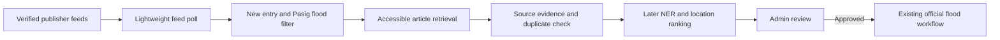

# RSS News Discovery Plan for LANES

> **Prepared:** September 24, 2026 by [@roicambe](https://github.com/roicambe) (Roi Cambe)
> **Status:** RSS registry, parser, checkpoint-aware discovery, three approved evidence tables, and staff-only endpoints are deployed. Development and Cloud SQL migrations passed; the Cloud Run job completed two manual runs and one Scheduler-triggered run on September 25, 2026. Event grouping and NER remain to be built.

This guide covers the **discovery and evidence-capture stage** of [Phase 36](../task_plan.md). The cleaned [Pasig DRRMO history](../../data/flooded_areas_pasig_clean.csv) is ready for later location ranking; it is not article text or an NER training set. The developer approved the three tables below under `AGENTS.md`; the migration passed against development PostGIS and Cloud SQL on September 25, 2026.

## What we are building

LANES will periodically read approved publishers' RSS/Atom lists, identify possible recent **Pasig flood** stories, and retrieve accessible article text for the most promising entries. RSS is a machine-readable list of articles, usually containing a title, link, date, and sometimes a short description. The publisher owns its feed; Google Cloud only runs LANES's collector. An RSS entry may not contain the full article.

The collector must not create a public flood report, activate a zone, change routing, or declare a flood verified. Those decisions belong to later extraction, location resolution, and staff moderation work.

## Source policy and links

The [Feedspot Philippines news directory](https://rss.feedspot.com/philippines_news_rss_feeds/) is a **candidate list**, not a runtime dependency or proof that every entry has a working publisher-hosted feed. Its ranking is not LANES's trust score. A source becomes enabled only after its publisher identity, feed endpoint, RSS/Atom parseability, article-link destination, access restrictions, and usefulness for Pasig flood coverage have been checked and recorded. **The first five publishers to investigate are ABS-CBN, GMA News, News5, INQUIRER.net, and Rappler.** The collector and source registry must also support additional verified Philippine publishers without redesign; verification, not membership in the first five, controls activation.

### Original five: feed leads and live pilot status on September 24, 2026

| Publisher | Publisher site | Feed lead | Observation and next check |
|---|---|---|---|
| GMA News | [GMA News](https://www.gmanetwork.com/news/) | [Publisher-listed news feed](https://data.gmanetwork.com/gno/rss/news/feed.xml) | **Enabled locally.** GMA's RSS directory linked this endpoint; direct Python probe parsed 15 recent publisher-linked entries, and a sample public article yielded text. Feedspot's **Generate RSS** label was not used. |
| INQUIRER.net | [INQUIRER.net](https://www.inquirer.net/) | [Full feed](https://www.inquirer.net/fullfeed/) | **Enabled locally for feed leads.** Direct probe parsed 20 recent links on `*.inquirer.net`; a sample news article returned HTTP 403, so it remains metadata-only unless public article text becomes accessible. The feed sometimes returned 403 on earlier attempts; report each failure. |
| Rappler | [Rappler](https://www.rappler.com/) | [Rappler feed](https://www.rappler.com/feed/) | **Enabled locally.** Direct probe parsed 10 recent publisher-linked entries and sample public article text. The earlier web checker was blocked, but the Python pilot could access the feed without bypassing a browser warning or login. |
| ABS-CBN News | [ABS-CBN News](https://www.abs-cbn.com/sp/news) | No publisher-hosted feed confirmed | **Disabled.** Feedspot's **Generate RSS** is not an ABS-CBN endpoint. Investigate a permitted publisher feed or alternative lead source. |
| News5 | [News5](https://news.tv5.com.ph/) | No feed confirmed | **Disabled.** News5 is absent from the two feed catalogs; do not substitute Interaksyon without checking publisher identity. |

Where a publisher feed is absent or inaccessible, keep that publisher in the registry as **disabled with a reason**. A permitted discovery source can later provide article links, but the final publisher domain and article access must still pass verification. A Google News RSS keyword query may be evaluated as an optional lead source; it is not a Google Cloud API or guaranteed publisher feed. Do not use Feedspot's paid/generated feeds by assumption, bypass paywalls, log in as a scraper, defeat bot protections, or treat Facebook as an automated source for this MVP. Staff-supplied public links/text remain a separate future/manual path.

### Open-source Philippines feed catalog cross-check (September 24, 2026)

[Plenary's `awesome-rss-feeds` repository](https://github.com/plenaryapp/awesome-rss-feeds) links a [Philippines OPML export](https://raw.githubusercontent.com/spians/awesome-RSS-feeds/master/countries/with_category/Philippines.opml) and has a readable Philippines list. The linked OPML contains 20 Philippine feed entries, including Philippine Information Agency and The Manila Times, which are absent from the visible repository table. It is a global catalog with a Philippines subsection, not a maintained guarantee that every Philippine publisher has a feed. Its Philippine entries include INQUIRER.net, GMA, Philstar, BusinessWorld, SunStar, Manila Standard, Current PH, Eagle News, Abante Tonite, BusinessMirror, PNA, and several others. Neither the visible list nor the linked OPML contains ABS-CBN, Rappler, or News5. Some entries, such as Top Gear and UNBOX PH, are not useful general flood-news sources. Catalog entries are leads only; do not import the entire OPML into production.

The initial web research checker attempted direct opens of the catalog and Feedspot feed leads. It could not display XML/RSS bodies for several endpoints. The observations below document that **earlier research-tool check**; the direct Python pilot recorded in the next section supersedes it where both tested the same URL. Neither environment is a substitute for a final Cloud Run check.

| Observed result | Feed leads tested | Interpretation |
|---|---|---|
| XML/RSS content type reported, body not available to checker | [GMA news XML](https://data.gmanews.tv/gno/rss/news/feed.xml), [Philstar headlines](https://www.philstar.com/rss/headlines), [Interaksyon on current Philstar domain](https://interaksyon.philstar.com/feed/), [Current PH](https://currentph.com/feed/), [Eagle News](https://www.eaglenews.ph/feed/), [Abante Tonite](https://tonite.abante.com.ph/feed/), [UNBOX PH](https://unbox.ph/feed/), [Davao Today](https://davaotoday.com/feed/), [Visayan Daily Star](https://visayandailystar.com/feed/) | Promising endpoint leads only. XML validity, recent entries, article links, and permitted article access remain unverified. GMA is an initial priority; the others may be added after verification. |
| HTTP 403 to checker | [INQUIRER.net](https://www.inquirer.net/fullfeed/), [GMA RSS directory](https://www.gmanetwork.com/news/rss/), [BusinessWorld](https://www.bworldonline.com/feed/), [Tempo](https://tempo.com.ph/feed/) | Do not assume the eventual collector will have access. Test from its execution environment and respect any restriction. |
| Blocked by checker or robots rule | [Rappler](https://www.rappler.com/feed/), [Top Gear](https://www.topgear.com.ph/feed/rss1) | No claim of live feed availability; do not bypass a restriction. |
| Checker could not retrieve | [SunStar](https://www.sunstar.com.ph/rssFeed/selected), [Manila Standard](https://manilastandard.net/feed/all), [BusinessMirror](https://businessmirror.com.ph/feed/), [PNA](https://www.pna.gov.ph/latest.rss), [PIA](https://pia.gov.ph/news/feed.rss), [The Manila Times](https://www.manilatimes.net/rssfeed/), [TechPinas](https://feeds.feedburner.com/Techpinas), [Panay News](https://www.panaynews.net/feed/), [Philnews.ph](https://philnews.ph/feed/), [Filipino News NZ](https://filipinonews.nz/feed/), [Plenary's older Interaksyon URL](https://www.interaksyon.com/feed/), [PhilNews.XYZ](https://www.philnews.xyz/feeds/posts/default?alt=rss), [Bicol Standard](http://www.bicolstandard.com/feeds/posts/default?alt=rss) | Unknown result; may reflect the checker, redirects, site changes, or source availability. Do not mark working or permanently broken from this result alone. |
| Checker cache miss | [Punto!](https://punto.com.ph/feed/), [Sunday Punch](https://punch.dagupan.com/feed/), [Metro Cebu News](https://metrocebu.news/feed/), [Our Daily News Online](https://ourdailynewsonline.com/feed/) | No live-result conclusion. |

The two catalogs overlap but have different coverage and ages. Keep the Feedspot 50 as the broad research inventory; use Plenary's list to discover possible URLs. The source registry used by LANES must be a separately reviewed list of verified feeds, starting with the original five publishers and expanding as other candidates pass the same checks.

### Direct Python pilot and local source activation (September 24, 2026)

The new `python -m scripts.run_news_discovery --probe --all-leads --ignore-proxy` command checked configured HTTPS feed leads with bounded responses and parsed RSS/Atom. The local proxy was refusing connections, so the pilot used a direct connection; this is **not** a test of Cloud Run's network path. These six feeds had recent publisher-domain entries and are enabled in the local registry:

| Publisher | Feed result | Sample article result | Local status |
|---|---|---|---|
| GMA News | 15 entries from the feed listed on GMA's RSS directory | Public article text extracted | Enabled |
| INQUIRER.net | 20 entries; `Last-Modified` header was stale and is ignored | Sample article HTTP 403; retain feed metadata only | Enabled, partial article access |
| Rappler | 10 entries | Public article text extracted | Enabled |
| Philstar.com | 10 entries | Sample text too short for reliable extraction; retain feed metadata only | Enabled, partial article access |
| BusinessWorld | 30 entries after a `www` to apex-domain redirect | Public article text extracted | Enabled |
| Interaksyon | 10 entries on its current `interaksyon.philstar.com` domain | Public article text extracted | Enabled |

Other leads were **not enabled**: some were stale (for example Visayan Daily Star, Sunday Punch, Eagle News), some returned `403`/`404`, and some need publisher identity, relevance, redirect, or article-access review. ABS-CBN and News5 still have no confirmed publisher feed. Development and Cloud Run discovery runs polled the six enabled feeds successfully and found **zero current Pasig flood candidates** in their sampled entries; that is an expected empty result, not a flood-status conclusion.

To repeat the local check from `backend/` on Windows, run `venv\Scripts\python.exe -m scripts.run_news_discovery --probe --all-leads --ignore-proxy`. The `--ignore-proxy` flag was needed only because this development environment's proxy refused connections. Use `--source feedspot-01` for one publisher, or `--discover` to run the six enabled feeds once. The command reports feed and article status but omits full article text from its JSON output. A failed feed remains visible as an error; it does not count as a successful source.

### All 50 Feedspot candidates

The following inventory preserves the directory's ordering as observed on September 24, 2026. **Every row began as a candidate; the local registry and pilot table above now identify the feeds enabled after checks.** Site domains are transcribed from the directory and are **not independently validated by the directory**. This inventory records URL leads from Feedspot, while the local registry also records leads discovered from Plenary or publisher pages. A dash means Feedspot did not confirm a publisher feed URL. Feedspot's “Generate RSS” label is intentionally not converted into a feed URL.

| # | Publisher | Site shown by Feedspot | Feed URL lead from Feedspot |
|---:|---|---|---|
| 1 | GMA News Online | `gmanetwork.com/news` | See publisher RSS directory above |
| 2 | INQUIRER.net | `inquirer.net` | `https://www.inquirer.net/fullfeed/` (HTTP 403 to checker) |
| 3 | Rappler | `rappler.com` | `https://www.rappler.com/feed/` (checker blocked) |
| 4 | ABS-CBN | `abs-cbn.com` | —; Feedspot says “Generate RSS” |
| 5 | Philstar.com | `philstar.com` | —; Feedspot says “Generate RSS” |
| 6 | Manila Bulletin | `mb.com.ph` | — |
| 7 | BusinessWorld | `bworldonline.com` | — |
| 8 | SunStar Philippines | `sunstar.com.ph` | —; Feedspot says “Generate RSS” |
| 9 | The Manila Times | `manilatimes.net` | —; Feedspot says “Generate RSS” |
| 10 | Manila Standard | `manilastandard.net` | — |
| 11 | BusinessMirror | `businessmirror.com.ph` | — |
| 12 | PTV News | `ptvnews.ph` | —; Feedspot says “Generate RSS” |
| 13 | The Daily Tribune | `tribune.net.ph` | — |
| 14 | Interaksyon | `interaksyon.philstar.com` | `https://interaksyon.philstar.com/feed/` |
| 15 | Malaya Business Insight | `malaya.com.ph` | —; Feedspot says “Generate RSS” |
| 16 | Mindanao Times | `mindanaotimes.com.ph` | — |
| 17 | MindaNews | `mindanews.com` | — |
| 18 | Davao Today | `davaotoday.com` | `https://davaotoday.com/feed/` |
| 19 | Panay News | `panaynews.net` | `https://www.panaynews.net/feed/` |
| 20 | Visayan Daily Star | `visayandailystar.com` | `https://visayandailystar.com/feed/` |
| 21 | Cebu Daily News | `cebudailynews.inquirer.net` | —; Feedspot says “Generate RSS” |
| 22 | Punto! Central Luzon | `punto.com.ph` | `https://punto.com.ph/feed/` |
| 23 | The Bohol Chronicle | `boholchronicle.com.ph` | — |
| 24 | Sunday Punch | `punch.dagupan.com` | `https://punch.dagupan.com/feed/` |
| 25 | SubicBayNews | `subicbaynews.com` | — |
| 26 | Philippine Information Agency News | `pia.gov.ph/news` | — |
| 27 | Northern Dispatch | `nordis.net` | — |
| 28 | Al Jazeera: Philippines | `aljazeera.com/where/philippines` | —; Feedspot says “Generate RSS” |
| 29 | AP News: Philippines | `apnews.com/hub/philippines` | —; Feedspot says “Generate RSS” |
| 30 | Abante News Online | `abante.com.ph` | —; Feedspot says “Generate RSS” |
| 31 | Abante Tonite | `tonite.abante.com.ph` | — |
| 32 | Tempo | `tempo.com.ph` | — |
| 33 | Philnews.ph | `philnews.ph` | `https://philnews.ph/feed/` |
| 34 | The Summit Express | `thesummitexpress.com` | —; Feedspot shows a truncated FeedBurner URL |
| 35 | Metro Cebu News | `metrocebu.news` | `https://metrocebu.news/feed/` |
| 36 | Wow-Cordillera | `wowcordillera.com` | —; Feedspot says “Generate RSS” |
| 37 | Journal Online | `journal.com.ph` | — |
| 38 | Metropoler | `metropoler.net` | — |
| 39 | Our Daily News Online | `ourdailynewsonline.com` | `https://ourdailynewsonline.com/feed/` |
| 40 | Current PH | `currentph.com` | `https://currentph.com/feed/` |
| 41 | Filipino News NZ | `filipinonews.nz` | `https://filipinonews.nz/feed/` |
| 42 | The Asian Journal USA | `asianjournalusa.com` | — |
| 43 | Unbox PH | `unbox.ph` | `https://unbox.ph/feed/` |
| 44 | TechPinas | `techpinas.com` | `https://feeds.feedburner.com/Techpinas` |
| 45 | Esquire Philippines | `esquiremag.ph` | — |
| 46 | Female Network | `femalenetwork.com` | — |
| 47 | Eagle News | `eaglenews.ph` | `https://www.eaglenews.ph/feed/` |
| 48 | One News | `onenews.ph` | —; Feedspot says “Generate RSS” |
| 49 | Philippine Entertainment Portal | `pep.ph` | —; Feedspot says “Generate RSS” |
| 50 | Philippine News Agency | `pna.gov.ph` | —; Feedspot says “Generate RSS” |

For each candidate, the implementation's source registry should record `publisher`, `site_domain`, `feed_url`, `source_kind` (publisher feed, permitted search lead, or manually supplied), `verification_status`, `verified_at`, `last_success_at`, `last_error`, `enabled`, and any publisher-specific polling limit. Site/domain aliases require explicit review; do not infer that a third-party feed belongs to the named publisher. A blocked or missing feed is visible to staff and does not silently become a successful source.

## Collection process

1. **Verify a source once, then review it periodically.** Confirm HTTPS, publisher control/identity, parseable RSS or Atom, recent item dates, final article domains after redirects, and permitted access. Record the check date and result. Investigate the original five first, then enable any additional source that passes the same verification; a large directory is not a reason to accept every publisher automatically.
2. **Poll feeds lightly.** A Cloud Run job checks enabled feeds on a configured schedule. Store each feed's `ETag` and `Last-Modified` headers and send conditional requests on later checks. Treat HTTP `304` as an unchanged feed. Use bounded timeouts, small per-host concurrency, and backoff on `429`/temporary failures. Never make one broken source abort the whole run. These techniques match [feedparser guidance](https://feedparser.readthedocs.io/en/stable/http-etag.html) and the [Miniflux implementation](https://github.com/miniflux/v2).
3. **Normalize each feed entry.** Capture publisher, feed ID/GUID if present, title, description, link, publication time, and fetch time. The [RSS 2.0 specification](https://www.rssboard.org/rss-specification) defines common `guid`, `link`, and `pubDate` elements, but feeds vary. Keep the original entry as evidence and normalize times to UTC for comparisons.
4. **Filter before opening articles.** Reject clearly irrelevant or stale entries; shortlist entries mentioning flood terms and Pasig/local place terms. Do not assume the absence of “Pasig” in a title proves irrelevance if the feed excerpt identifies a Pasig barangay or road. Surface uncertain items for later inspection rather than declaring them a flood.
5. **Deduplicate entry and article identities.** Use the source feed plus GUID/ID for repeated feed entries; use final canonical publisher URL and a normalized title/content fingerprint for the same article seen through several feeds or a news search lead. Record all discovery paths but do not create duplicate candidates. Refresh an existing article if the publisher updates its text.
6. **Fetch only shortlisted public articles.** Follow redirects only to checked publisher domains; enforce response size and time limits. Extract title, byline if available, publication/update time, and body text using a general parser plus reviewed publisher-specific selectors when needed. A short RSS excerpt or inaccessible article stays a **metadata-only lead**, not a successful full-text NER input. Do not bypass paywalls or bot controls. Miniflux uses [per-feed filtering and scraper rules](https://miniflux.app/docs/rules.html) for this same separation.
7. **Group likely reports of one incident.** First compare place mentions, event/publish time, and text similarity. Preserve every supporting article and its independent publisher. Similar syndicated wording or an article copied by another site does not count as independent corroboration. Once an incident has sufficient distinct evidence, avoid repeating costly full extraction on near-duplicate stories; continue the lightweight feed scan for new places, changed depth, rising/receding status, and later corrections. Corroboration improves evidence but does not itself approve a map zone.
8. **Hand off evidence.** The later NER service receives publisher, canonical URL, headline, publication/fetch times, article text when accessible, and evidence excerpts. It extracts place/depth/condition/date spans; the later resolver uses the cleaned DRRMO history and map geometry to rank locations. Staff review the source evidence and proposed geometry before the existing official-zone workflow may activate anything.

**NER boundary:** This guide covers finding articles and preparing their evidence. [Phase 36's Taglish extraction tasks](../task_plan.md) separately call for checking calamanCy's Tagalog spaCy model license, compatibility, and CPU behavior, then pairing it with LANES rules and a Pasig place-name list. A feed title or short excerpt can be a lead, but it must be labeled as such when full article text is unavailable; discovery does not claim that calamanCy has extracted or confirmed a flood location.

This staged approach permits many quick feed checks without treating every entry as a full article or every article as a separate flood. Stopping deep work for one well-covered incident must never stop discovery of another incident. Keep per-source and per-run counts of checked feeds, new entries, shortlists, full-text successes, duplicates, metadata-only leads, and failures.

## Implemented tools and remaining files

The local RSS slice uses the backend's existing `httpx` dependency and Python's standard-library XML and HTML parsers. The XML parser supports RSS 2.0 and Atom with response-size and DTD limits; article extraction is intentionally conservative and returns a metadata-only lead when it cannot get reliable text. The backend remains layered as required by `DESIGN.md`.

### Reuse decision before coding

| Open-source option | What it supplies | LANES decision |
|---|---|---|
| [Plenary's feed catalog and OPML](https://github.com/plenaryapp/awesome-rss-feeds) | Candidate Philippine feed URLs | Use only for research and source verification. Do not make it a runtime dependency or treat its entries as approved publishers. |
| [feedparser](https://feedparser.readthedocs.io/en/latest/) plus [Trafilatura](https://trafilatura.readthedocs.io/en/latest/) in Python | Broader feed parsing and public article extraction | Possible upgrade if the standard-library pilot shows real publisher failures or poor text quality. They are **not installed or imported** in the current code; add pinned dependencies and tests if selected. |
| [Miniflux](https://github.com/miniflux/v2) | A separate feed collector with [OPML import and an API](https://miniflux.app/docs/api.html), filtering, and article fetching | Feasible alternative if the Python pilot shows that feed polling/maintenance is costly. It introduces another running service and integration path, while LANES still owns flood filtering, grouping, NER, and review. Prototype separately before replacing the proposed collector files. |
| [FreshRSS](https://github.com/FreshRSS/FreshRSS) | Another self-hosted feed reader with OPML and APIs | Reference/alternative; an additional PHP application is not the simplest first fit for the current Python backend. |
| [RSSHub](https://github.com/DIYgod/RSSHub) | Routes that generate feeds for some sites | Do not assume it supports ABS-CBN, News5, or Rappler. Consider a specific route only after checking its publisher mapping, access behavior, and maintenance. It is not a substitute for publisher verification. |

The local pilot above established an initial working set. Re-run the same source checks in the intended Cloud Run environment before scheduling. For publishers without a permitted working direct feed, keep them disabled and evaluate the Phase 36 Google News RSS lead path or staff-supplied links. The collector can accept additional verified sources by registry configuration.

| Path | Status | Purpose |
|---|---|---|
| `backend/app/news_sources.json` | Implemented | 50 Feedspot candidates plus News5; six locally verified feeds are enabled. |
| `backend/app/services/news_sources.py` | Implemented | Source validation, allowed publisher domains, and verified/enabled gating. |
| `backend/app/services/news_feed_service.py` | Implemented | Bounded `httpx` polling, conditional headers, RSS/Atom parsing, entry normalization, and explicit per-feed failures. |
| `backend/app/services/news_discovery_service.py` | Implemented | Flood/Pasig shortlisting, safe public article retrieval, metadata-only fallback, checkpoint-aware polling, and deduplication. |
| `backend/app/models/news.py`, `backend/app/crud/news.py`, `backend/alembic/versions/a83c1d4e7b92_add_news_discovery_storage.py` | Deployed | Three approved tables, article/GUID persistence, conditional checkpoints, and migration verified in development and Cloud SQL. |
| `backend/app/schemas/news_candidate.py` | Implemented | Typed staff source, probe, pending article, and run-summary responses; later NER candidate schema remains pending. |
| `backend/app/api/v1/endpoints/admin_news.py`, `backend/app/api/v1/api.py` | Implemented | Staff-authenticated source list, per-source probe, persisted feed health, pending evidence with provenance, and on-demand discovery trigger. Review decisions are later work. |
| `backend/scripts/run_news_discovery.py` | Deployed | One-run `--probe`, persistent `--discover`, and `--discover --dry-run` commands; `lanes-news-discovery` executes `--discover` on Cloud Run. |
| `backend/tests/test_news_discovery.py` | Implemented | Offline parser, auth, source-policy, deduplication, redirect, no-activation, and repeat-run checkpoint coverage. |
| `backend/app/services/news_event_grouping_service.py`, `backend/tests/test_news_event_grouping.py` | Later | Group articles by likely place/time and distinguish independent evidence from syndication. |
| `backend/requirements.txt` | No change | `httpx` was already pinned; no new third-party library was imported. |
| `cloudbuild.yaml` | Existing API pipeline | The `main` trigger runs the migration job before deploying `lanes-api`. The separate RSS Cloud Run job and Scheduler were configured in Google Cloud; their ongoing image updates require an explicit deployment step. |

The developer approved the three evidence tables below. `alembic upgrade head` passed against development PostGIS, and Cloud Build `8d552907` completed the production migration before deploying API revision `lanes-api-00035-khl`. Review unresolved Phase 33 data-integrity work before connecting approved AI candidates to Flood Events.

### Approved durable storage (implemented in code)

The version-controlled JSON file remains the publisher configuration. The following three tables are defined by SQLAlchemy and Alembic revision `a83c1d4e7b92` and exist in development PostGIS and production Cloud SQL.

| Proposed table | Key fields and constraints | Why it is needed |
|---|---|---|
| `news_feed_checkpoints` | Unique `feed_url`, `source_id`, `etag`, `last_modified`, `last_checked_at`, `last_success_at`, `last_error` | Reuse conditional headers and show feed health across scheduled job restarts. |
| `news_articles` | Primary key, unique canonical publisher URL, `publisher_source_id`, title, excerpt, published/fetched/first-seen/last-seen times, nullable article text and fetch error, content fingerprint, review state | Keep one article and its evidence even if discovered repeatedly. An inaccessible body remains a labeled metadata-only lead. |
| `news_article_feed_entries` | Primary key, article foreign key, source/feed URL, feed GUID, first/last seen times, unique source + feed URL + GUID, optional raw feed metadata in JSONB | Preserve every discovery path without duplicating article text or losing provenance. |

The migration adds uniqueness and a foreign-key check, and seeds no approved flood report. The collector retains a feed's conditional headers across runs, keeps one article per canonical URL, and records each feed GUID as provenance. `GET /api/v1/admin/news/feeds` shows feed failures; `GET /api/v1/admin/news/candidates` shows pending evidence and feed links; `POST /api/v1/admin/news/runs` triggers a staff-only run. `python -m scripts.run_news_discovery --discover` persists by default after migration; add `--dry-run` to inspect without database writes. Event grouping and NER review fields may require later approved schema changes; no candidate creates a public map zone automatically.

## Google Cloud deployment sequence

### Production deployment verified September 25, 2026

- PR [#105](https://github.com/pu-roi/LANES/pull/105) merged into `main`. The `^main$` Cloud Build trigger ran `cloudbuild.yaml`; build `8d552907` completed the migration job and deployed `lanes-api-00035-khl`.
- Cloud Run job `lanes-news-discovery` in `asia-east1` uses the backend image from merge commit `60b03aa`, the existing `lanes-api-runtime` identity and Cloud SQL connection, and separate arguments `python`, `-m`, `scripts.run_news_discovery`, `--discover`. Two manual executions succeeded; the first attempted execution failed because its arguments were passed as one string, then the job configuration was corrected.
- Both successful manual runs parsed the six enabled publisher feeds without feed errors. The second reused stored checkpoints and received conditional unchanged responses. No sampled entry met the Pasig flood shortlist; this does not indicate that Pasig has no flooding.
- Cloud Scheduler job `lanes-news-discovery-every-3-hours` runs at `0 */3 * * *` in `Asia/Manila`. Service account `lanes-news-scheduler` has `roles/run.invoker` on this job only. A manually dispatched Scheduler run created execution `lanes-news-discovery-6h442`, which completed successfully.
- The RSS job is configured separately from `cloudbuild.yaml`. A future backend build will update `lanes-api` and `lanes-migration` but **will not update the RSS job image**. Update and verify the RSS job image deliberately when collector code changes. No news UI or automatic public flood-zone activation is deployed.

1. Build and test the collector locally with saved RSS/Atom and article fixtures, plus a staff-triggered run against a small number of verified live sources. Keep the implementation mockable; tests must not rely on live publisher availability.
2. Package the one-run script in the existing backend image and create a dedicated **Cloud Run job** in `asia-east1`. Use a service account with only the access it needs. Limit per-host requests and set job timeout/retry behavior so failures are visible.
3. Add a **Cloud Scheduler** trigger only after a manual job run succeeds. Google's [Cloud Run scheduling guide](https://docs.cloud.google.com/run/docs/execute/jobs-on-schedule) describes the console flow. Cloud Scheduler is [at-least-once delivery](https://docs.cloud.google.com/scheduler/docs/overview), so the collector and its persistence must be idempotent.
4. Log source failures, counts, and job duration in Cloud Logging. A failed publisher must be recorded and retried later without inventing an article or approving a zone. Check cost and rate behavior with a small source batch before broadening the registry.

## Verification and acceptance criteria

- The inventory has exactly 50 Feedspot candidates plus the separately listed News5 priority source; candidate listings are visibly distinct from verified/enabled feeds.
- Each enabled feed returns parseable recent entries, resolves to an approved publisher, and has a dated verification record. A feed with `403`, `429`, invalid XML, robots/access restrictions, or an unexpected redirect is disabled or reported with its actual error.
- A no-change conditional response does not produce article fetches. Repeated scheduled runs, retries, and duplicate feed/search leads do not create duplicate articles or candidates.
- A Pasig flood article is shortlisted and its accessible text/evidence retained; an irrelevant item does not trigger full retrieval. A blocked article stays a metadata-only lead and is never passed as full-text evidence.
- Two articles about one event are grouped without losing either attribution; syndicated copies do not count as independent support; a later article reporting a changed flood condition remains visible.
- Only staff can trigger or inspect the discovery queue. Discovery, pending candidates, failed sources, and rejected candidates do not change public zones, routing, analytics, or notifications.
- Any later UI is checked on mobile and desktop; any new dependency, endpoint, schema, or deployment is synchronized with the appropriate project documentation when implemented.

## Research references

- [RSS 2.0 specification](https://www.rssboard.org/rss-specification) — entry fields and identifiers.
- [feedparser conditional HTTP guide](https://feedparser.readthedocs.io/en/stable/http-etag.html) — `ETag`, `Last-Modified`, and `304` handling.
- [Miniflux repository](https://github.com/miniflux/v2) and [filter/scraper rules](https://miniflux.app/docs/rules.html) — a practical open-source feed-reader design.
- [Cloud Run scheduled jobs](https://docs.cloud.google.com/run/docs/execute/jobs-on-schedule) and [Cloud Scheduler delivery](https://docs.cloud.google.com/scheduler/docs/overview) — deployment and idempotency requirements.
- [Feedspot Philippines news directory](https://rss.feedspot.com/philippines_news_rss_feeds/) — source-discovery list only, reviewed September 24, 2026.
- [Plenary `awesome-rss-feeds`](https://github.com/plenaryapp/awesome-rss-feeds) and its [linked Philippines OPML](https://raw.githubusercontent.com/spians/awesome-RSS-feeds/master/countries/with_category/Philippines.opml) — additional open-source URL leads, reviewed September 24, 2026.
- [Trafilatura Python usage](https://github.com/adbar/trafilatura/blob/master/docs/usage-python.rst), [Miniflux API](https://miniflux.app/docs/api.html), [FreshRSS repository](https://github.com/FreshRSS/FreshRSS), and [RSSHub repository](https://github.com/DIYgod/RSSHub) — reuse options reviewed for the collector design.
