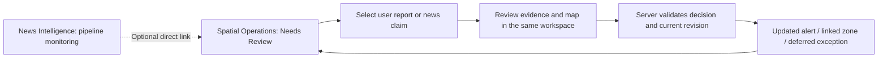

# Phase 36: Priority 5 Publication, Review, Corrections, Expiry and Frontend Plan

> **Last Updated:** October 05, 2026, 10:45 PM by [@roicambe](https://github.com/roicambe) (Roi Cambe)

**October 5 trusted-footprint contract (current):** BUG-107/108/109/110 are repaired locally. Operational approval now requires an operator-approved exact current incident record or an authenticated staff review; explicit SRID, full locality coverage and every component are checked. Source labels, modeled geometry and missing boundaries cannot approve a zone. Unsupported newer observations become text-only alerts and withdraw unsupported prior coverage. **398 distinct checks pass**: 200 targeted, 194 related and four event regressions. No real current footprint catalog is provisioned. Next connect that approved source to the real worker, then desktop/mobile map polygons and full lifecycle/routing/staging/PWA acceptance. No SQLAlchemy model/migration/dependency, normal/cloud data, frontend or release change. [Verification](../evaluations/phase-36-trusted-footprint-contract.md). [@roicambe](https://github.com/roicambe) (Roi Cambe)

**Earlier October 5 independent evaluation follow-up:** strict provider-separated auditing, immutable full-article evidence and durable claim/leased evaluation services are implemented locally. Explicit bounded seeding/evaluation uses the approved tables and does not publish alerts, decisions or zones. The same September 27 OSM snapshot now resolves C5 through explicit route relations, with 45 Pasig ways/14 ambiguous sections; twenty source-backed Pasig OSM community polygons now support previews including Ugong, while ten Pasig barangays, broader boundary coverage and operational affected footprints remain unsupported. Next implement atomic publication/correction/expiry and safe public reads, alongside geometry/asset acceptance, then F6/F7. [Current verification](../evaluations/phase-36-independent-evaluation-and-spatial-coverage.md), [operator guide](../guides/news-claim-evaluation.md). [@roicambe](https://github.com/roicambe) (Roi Cambe)

**Earlier October 5 continuation checkpoint:** the three referenced pipeline/plotting/expiry chats and current backend were reviewed. Explicit approval and five-table storage implementation are complete locally; migration `d7e4b9a21c60` and 60 focused checks pass. The [ordered backend slices](news-publication-readiness-plan.md#october-5-continuation-checkpoint) now advance from delivered independent auditing/claim evaluation to locked publication and lifecycle services. The observation-based two-hour fallback is accepted; runtime status projection, retention/routing and operational geometry gates stay open. F5 inspection and this interface plan remain intact. The developer subsequently authorized the v11 review-aura styling delivered below; F6/F7 public/decision integration still awaits backend contracts. Complete automatic plotting with basic freshness before release, then evaluate duration prediction primarily in Pasig. [Storage evidence](../evaluations/phase-36-news-publication-storage.md). ([@roicambe](https://github.com/roicambe) (Roi Cambe))

> **October 4 revised lifecycle follow-up:** The developer accepted **Unconfirmed** alongside Active and supported Cleared, survival investigation, and a **two-hour fallback from the latest eligible supported flood observation where duration support is insufficient**. Adaptive bounds, retention/routing and model selection follow the [study plan](flood-evidence-lifecycle-and-duration-plan.md) and [RRL](../research/metro-manila-flood-duration-rrl.md); model-result graphs are required. Apply the same uncertainty, last-observation/source and separate estimated-clearance meaning to F6/F7 desktop/mobile. Record a future public-map commuter observation action on Unconfirmed areas, with server validation/trust/conflict handling for refresh or clearance; it is not implemented. ([@roicambe](https://github.com/roicambe) (Roi Cambe))
> **Status:** F5 inspection, F6 local audited exception controls and F7 desktop/mobile source-alert visibility are implemented. Source alerts have automatic publication/refresh/clearance/expiry and safe public reads. Full linked-zone activation, wider Results/Overview handoffs/Next item, physical PWA/manual acceptance and F8 deployment remain pending.

**Primary Panel implementation follow-up:** F5 inspection retains the existing source card design and now supports server-side text/city/barangay/severity filters before pagination, full related-group context, shared flat report/zone/contributor details and compact desktop/touch-aware actions. Filtering preserves canonical group membership and existing moderation/merge targets. 33 backend and 38 distinct desktop/mobile browser cases pass with TypeScript/scoped lint; developer visual acceptance and durable news decisions/publication remain open. [Implementation](../evaluations/phase-36-needs-review-inspection.md#october-4-primary-panel-search-and-detail-consistency), [checkpoint audit](../evaluations/phase-36-needs-review-inspection.md#october-4-primary-panel-push-audit). ([@roicambe](https://github.com/roicambe) (Roi Cambe))

**Delivery target reaffirmed October 3:** automatic RSS/news → NLP/NER → bounded OSM placement assisted by UP NOAH source-vector overlap and matching Pasig DRRMO history → automatic map publication and gated zone activation. Routine eligible claims bypass Needs Review. Staff handles exceptions and corrections. Complete the runtime/lifecycle contracts, then implement F5/F6 exception controls and F7 commuter visibility within one delivery bundle; the stage numbering does not require all staff screens to finish before automatic publication work starts. Automatic end-to-end operation remains pending. ([@roicambe](https://github.com/roicambe) (Roi Cambe))

**October 4 readiness reconciliation (historical assessment):** delivery at that checkpoint was local F5 inspection with v10 OSM/NOAH/DRRMO previews. The assessment proposed five additive tables and required approval before implementation. That approval, storage delivery and the accepted two-hour fallback are recorded in the October 5 continuation above; v11 subsequently delivers disconnected preview geometry. Operational geometry/boundaries, matching analytical assets and F6/F7 runtime publication remain open. Retain shared components and the existing active-zone renderer. The nationwide target is separate from current Metro Manila coverage; Pasig history contains no flood duration data. [Readiness evidence](../evaluations/phase-36-publication-readiness-audit.md). ([@roicambe](https://github.com/roicambe) (Roi Cambe))

**October 5 v11 placement follow-up:** news previews now use shared transparent severity auras for exact disconnected modeled road pieces; missing reported depth uses gray. Backend locality validation and reviewed-boundary loading/clipping are implemented. Actual polygon provisioning and automatic activation/publication/expiry remain pending. [Verification](../evaluations/phase-36-disconnected-news-placement.md). [@roicambe](https://github.com/roicambe) (Roi Cambe)

## 1. Reviewed baseline and task order

**Monday deployed-site demonstration:** the developer confirmed October 5, 2026 and the deployed website as the presentation target. Focus October 3 on one complete automatic source→facts→OSM/NOAH/DRRMO placement→eligible zone/map flow, including actual auditor participation. Focus October 4 on release/version/migration/configuration checks and rehearsal against the deployed URL with repair time. Reuse the current article reader and map, implementing minimum publication visibility and exception/correction controls before additional staff-interface polish. F5/F6/F7 acceptance remains required for the changed flows but their entire optional presentation backlog is not a prerequisite. Original routing eligibility gates remain in force. A historical replay must be clearly labeled and isolated from live public zones/routing; no replay implementation is currently claimed. This schedule is a priority target, not verified delivery. See the [active deadline checklist](../task_plan.md#automatic-pipeline-delivery-target--reaffirmed-october-3). ([@roicambe](https://github.com/roicambe) (Roi Cambe))

Read the root `AGENTS.md`, `DESIGN.md`, `frontend/AGENTS.md`, documentation index, Phase 36 task plan, delivery records, relevant news/spatial/history plans and evaluations, screen/API/database references, and the senior-planner, UI, API, security and test skills under `.agents/skills/`. The frontend-specific rules require installed Next.js guides to be read before future code changes. Existing source was inspected to check integration points; no application code was changed for this plan.

| Priority | Recorded outcome | Remaining limitation |
| --- | --- | --- |
| 1: Retrieval | Accessible publisher bodies were retrieved; blocked/incomplete bodies have visible failure paths. | Successful live automatic alternate-body recovery is unverified. |
| 2: Discovery | Controlled discovery, time/update comparison and copied-body checks exist. | A fresh automatically discovered eligible incident and positive same-event matching remain unverified. |
| 3: Collection to extraction | Deployed immutable article inputs, leased rules processing and source-linked results; repeat processing creates no work. | This proves saved-body processing, not fresh incident discovery or public publication. |
| 4: Verified location matching connection | Deployed checksum-identified OSM placement evidence. A historical source span matches an 86.2 m centerline. | All 50 backlog placements are unresolved. A matched centerline does not verify current flooding, flooded width or routing closure geometry. |
| **5: Publication, exception review, corrections and expiry** | **Needs Review evidence/placement inspection is implemented locally; decision and publication lifecycle remain unfinished.** | Requires explicit publication decisions, durable lifecycle/audit/link identity and real API/developer acceptance. |
| 6: Operational freshness/visibility | Existing feed and processing status are available to staff APIs. | Full latency, freshness, source health and scheduling assessment remains later work. Priority 5 must still surface its own errors and expiry. |

The six improvement priorities are different from recovery Gates 1–6. Priority 5 spans unfinished publication work in Gate 4, exception decisions in Gate 5, and release acceptance in Gate 6. It does not mark those gates complete.

The latest deployment evidence is in [the OSM processing evaluation](../evaluations/phase-36-reusable-road-match-check.md#production-release-verification). Older notes describing processing as disconnected are historical. [Activation safety](news-activation-safety-gates.md) governs writes; old confidence thresholds, arbitrary buffers and prototype test results cannot authorize publication.

## 2. Priority 5 lifecycle contract before screen implementation

The FastAPI backend owns eligibility, suppression, incident comparison, expiry, allowed actions and routing decisions. The frontend displays the returned decision and sends an explicit staff request; it does not promote extraction labels into public status.

| Outcome | Intended behavior | Routing effect |
| --- | --- | --- |
| Incomplete source or unresolved current-evidence prerequisites | Staff-only exception/lead with reason and retry information. | None |
| Credible recent source claim, affected segment unresolved | Automatically publish a source-labeled news alert after the separate alert policy passes. Missing map coverage alone does not veto a credible report. | None |
| Current claim with verified affected geometry and all activation gates | Automatically create or link an expiring operational zone through the server-owned workflow, without routine staff approval. Record reported versus predicted placement. | Backend applies the existing vehicle-specific routing policy. |
| Conflicting evidence or ambiguous incident update | Retain evidence and require an exception decision; conservative handling of any existing linked state must be specified. | No automatic promotion or unrelated-zone removal. |
| Historical, forecast, negated or subsided claim | Preserve the evidence and reason. Do not publish it as a current flood alert or create a current closure. A matched later clearance can end existing state. | Only a verified update to the same linked incident can end its restriction. |
| Correction, withdrawal or expiry | Update public visibility and any linked operational state consistently, keeping source evidence and decision history. | Linked restriction must stop applying when withdrawn or expired. |

Publication visibility, extraction status, review state, placement precision and routing state are separate dimensions. An active source alert can coexist with unresolved placement; an expired alert does not prove a road is dry. A broad place must not be shown as an exact flood coordinate.

Before implementing writes, specify and test:

1. **Alert eligibility:** approved publisher or authenticated staff provenance, usable source evidence, non-forecast current flood status, location scope, explicit observation-time requirements, missing-time behavior and contradictory/caption-only evidence. Publication time and fetch time cannot substitute for observation time. A news alert may have unknown depth; zone gates remain stricter.
2. **Identity and revisions:** bind a decision to immutable article input, extraction run and claim evidence; define stable continuity across reruns and map refreshes. Deduplicate retries and copied/syndicated coverage without treating them as independent confirmation. Similar road names/titles cannot merge unrelated floods.
3. **Persistence:** assess existing tables for per-claim public state, decisions, versions, expiry, optimistic concurrency and links to reports/events/zones. Do not edit extraction results or feed metadata to hide mutable decisions. Produce exact schema/constraint and migration/backfill proposals if storage is insufficient; obtain separate developer approval before SQLAlchemy/Alembic edits.
4. **Atomicity and links:** verify publication, source report, event/zone links and audit history commit together. Inspect prototype helpers' internal commits before reusing them. A transaction failure or lost worker must not leave an orphan activation or report success. Account for the open Phase 33 origin/evidence-integrity work; do not invent evidence for existing orphan events.
5. **Corrections and clearance:** preserve original sentence/body, show the staff override separately, require actor/time/reason, retain public correction text separately from internal notes, reject outdated client revisions and match clearance to the same place/segment/incident. One source withdrawal must not end a zone still supported by other current evidence without an explicit policy.
6. **Expiry:** agree the news-alert and zone lifetimes and their time basis. The existing 12-hour activation freshness window is not an agreed alert TTL. Retries/re-fetches/map refreshes cannot extend lifetime. Exclude expired state from reads/routing even when maintenance is delayed; preserve audit history and end events only when their final live zone ends.
7. **Release:** stage the full path first. Production automatic routing activation requires the real-article safety evaluation and developer review already specified in recovery Gate 6.

## 3. Frontend plan grounded in existing navigation

Retain the existing feature-based frontend, persistent map and shared components. Add news-specific presentation/hooks under `src/features/news/`; use thin admin integrations under `src/features/admin/`. Existing source evidence screens, `Button`, `Tabs`, `Panel`, form controls, confirmation dialogs and shared map/camera utilities are reuse candidates. Avoid nested bordered cards and additional standalone moderation maps.

| Existing surface | Proposed addition | Responsibility |
| --- | --- | --- |
| `/admin/news`; accepted reading design | News Intelligence navigation opens one Flood Locations list; Info has Flood Details / Source Article. Collection status is a drawer on the same page, with processing history under More details. | Inspect specific reported locations while retaining failed/empty/questionable articles without duplicate article/result lists. Verification remains in Spatial Operations. Desktop/mobile manual acceptance pending. |
| `/admin/moderation` | Keep existing Community and Flood Reports tracking | Optional news counts/links open Spatial Operations review; do not add another editable news queue. |
| `/admin/map` | Rename **Pending Reports** to **Needs Review**; retain **Active Zones** | The accepted interface combines user reports and news claims in one review queue with All/User Reports/News Claims source filters. All includes only cases currently needing review, not active zones or completed decisions. Selecting either source opens its evidence and map workspace in place. Preserve existing Create/Merge/Edit drafts and independent selections. |
| `/map` through persistent `GlobalMap` | **News alerts** entry and shared responsive panel | Read source-labeled active alerts and corrections without blocking route planning. Keep news geometry distinct from active-zone and modeled-NOAH layers. |
| Existing staff audit/history surfaces | Linked decision history and verified event/zone handoffs | Public alerts alone do not count as verified Flood Events in analytics. Withdrawn/expired claim history is not a recycle-bin deletion. |

Proposed staff journey:

These are proposed additions, not delivered routes or endpoints.

## 4. Staff screens and actions

**Accepted Needs Review queue:** one list of user reports and news claims that currently need a staff decision. The three source filters are All (both sources), User Reports and News Claims; these are filters inside the same main tab, not additional navigation pages. Every row carries a clear source badge and reason for review. Active zones and completed/rejected decisions are excluded from this queue unless an explicit authorized lifecycle transition reopens a case. Deferred cases follow the agreed backend due/visibility policy. News Intelligence Results and existing moderation/history views retain non-pending outcomes for inspection. Missing-body feed leads or processing failures without a claim stay in pipeline monitoring rather than becoming fabricated map-review claims.

Provide server-owned ordering, counts and pagination across both sources, with source/review-reason/location/evidence-date filters where supported. Keep source identities distinct even when numeric IDs coincide. An article with several flood locations contributes separate claim cases, not one article-wide approve action. Do not present `flagged_review` as synonymous with unpublished or extraction `completed` as approval. Include loading, empty and explicit API failure states.

**Read-only evidence detail:** show publisher/title/source link, source sentence and surrounding relevant text, original extracted place/span, depth wording and supported physical measurements, condition, passability, publication time, observation time and unknowns. Show model/rule/map provenance and coverage limits in expandable staff detail. Do not show ranking as a percentage likelihood or present shared depth ranges as exact per-road values.

**Spatial review:** desktop keeps source details beside the persistent map and uses the existing contextual second pane. Mobile switches between Evidence and Map with the same selected claim and retained draft. Display multiple supported candidates with no initial selection; unmatched/unresolved claims retain their text and coverage reason. Candidate lines are labeled **Placement suggestion** and use a dedicated layer rather than the active-zone fill. Clicking a candidate does not establish flooding or activate it.

**Decision controls:** show only actions allowed by the server for the current revision. Proposed actions are Correct details, Defer, Reject claim, Withdraw alert, Confirm corrected claim, and Open linked zone. Separate alert confirmation from zone activation; the button and confirmation summary must state the exact public/routing effect. A selected OSM line or staff click cannot bypass missing current evidence or affected-geometry requirements. Require reasons for decisions and show public correction text separately from internal notes. Retain edits on request failure; show stale-version conflicts and reload/compare before resubmission. Pending writes disable duplicate submissions; an uncertain timeout requires reading durable outcome before retrying.

After a successful decision, refresh the same queue and offer Next item. Keep source filters, list position and map context; no return to News Intelligence is required between items. On mobile, use Evidence/Map views and Back to queue with the same selection/draft. Opening a second item must not silently replace unsaved review or existing Create/Merge/Edit drafts. Keep any saved drafts account-private using the established storage approach.

## 5. Commuter experience and responsive behavior

Recommended desktop entry: a collapsed **News alerts** control integrated with existing map controls; opening it uses the shared panel. It should not add a permanently expanded sidebar or overlap the route planner. Recommended mobile entry: the existing `+` menu opens a shared sheet, with an unobtrusive active-alert count if the server provides one. Opening the alert sheet coordinates with other panels rather than stacking them.

List items show reported place/city, publisher, condition, reported depth when available, explicit observation time or **Observation time unavailable**, and a readable freshness/status label. Details show source attribution/link, the supported excerpt, correction notice, expiry time and location precision. Display Philippine time consistently. Do not label publication time as observed time or claim unknown geometry is safe.

**News alert** means source-reported flooding; explanatory copy says **No routing restriction from this alert** when appropriate. For a linked zone, show **Routing restriction active** plus affected vehicle information supplied by the backend. Distinguish **Reported span** from **Predicted placement** when that future verified tier is enabled. Avoid copying internal pipeline IDs, checksums or staff notes into commuter cards.

Only evidence-supported display geometry gets a **View reported location** action. A bounded placement candidate can appear as a labeled line preview, not a flood-width polygon. A broad city/road or missing map coverage can remain text-only; do not invent a precise marker or close an entire road. Never reuse the NOAH scenario overlay as live evidence. The news preview source must not enter active-zone routing queries.

Use shared animations, keyboard focus/escape behavior, explicit Back actions, readable text and touch targets. Check 1440px desktop, 390px mobile, 320px narrow view and landscape; clear bottom navigation with `var(--bottom-nav-height)` plus safe-area insets. Preserve map viewport, route selection, 2D/3D mode and drafts through panel changes.

Public reads show only server-published fields. An error must not appear as **No flood alerts**. Offline/cached content is labeled stale and cannot imply a current restriction or fresh expiry decision; staff writes require connectivity and authoritative confirmation. SSE may invalidate/refetch state through the established mechanism, with reconnect/refetch fallback; no new WebSocket requirement. A withdrawn/expired selected alert must close or show its ended state on refresh, and a linked zone refresh must reach the routing/map consumers.

## 6. Proposed API contract requirements

Existing `/admin/news` endpoints now also provide durable claim/history reads and revision-guarded preview/decision APIs; public `/news/alerts` exposes safe source-alert projections. Do not implement a fake public lifecycle by directly rendering pending candidates.

Design a unified staff review list with server-side source filters, ordering/counts and pagination while preserving distinct user-report and news-claim identity and evidence schemas. Use source-specific detail/decision rules behind the shared frontend workspace; the UI must not convert a news claim into a user report or merge separately paginated results locally. Design monitoring/result reads, public active-alert/detail reads and update notifications separately. Exact endpoint names and schemas remain proposals until lifecycle/storage design. Staff responses need source/version references, extraction and placement evidence, decision history, reasons, expiry, linked domain IDs, allowed actions and an expected revision token. Public responses need safe source identity/link, excerpt, reported place/time/depth qualifiers, public correction text, visibility state, location precision/display geometry and backend-calculated routing label/profile restrictions. Public schemas exclude internal notes and private evidence metadata.

All staff reads and writes enforce authenticated active staff roles in FastAPI before record lookup, plus bounded queries and rate limits. Reuse `apiClient` and TanStack Query; the backend controls scope, order, filters, counts, age gates and decisions. JWT handling stays consistent with the current PWA/WebView architecture. React escapes source text; no raw publisher HTML. Backend validates public source URLs and suppresses unsafe links.

## 7. Frontend delivery phases and acceptance

These are frontend stages within **Phase 36, Priority 5**, not new capstone phases or recovery gates. F1/F2 are implemented; F3 reading is implemented with remaining manual acceptance; F4 monitoring has documented release evidence. F5 combined inspection and reviewed user-report growth are locally implemented with recorded desktop/mobile checks, while developer visual/native news-placement acceptance remains open. F6 durable news decisions and F7 public source alerts are implemented locally; F7 operational zones and F8 integrated release acceptance remain pending. Deliver reviewable slices against shared backend contracts; existing F5 inspection does not require restarting the frontend plan. Plan author: [@roicambe](https://github.com/roicambe) (Roi Cambe).

### Prerequisites checked within each stage

The former F0 checklist is absorbed into F1–F8. The frontend direction is already agreed; use these checks to implement that direction, not restart design selection. Wireframes and unverified contracts are not marked complete by this change.

- Draw desktop and mobile flows for News Intelligence, Needs Review, and the commuter alert entry. Include article/result detail windows and their loading, empty, missing-body and error states.
- Map each screen field and action to an existing API or a missing contract. Define article/claim/source identities, pagination, server counts, allowed actions, version conflicts and safe public fields. Record missing capabilities as backend prerequisites.
- Agree Priority 5 eligibility, continuity, corrections, shared-source withdrawal and expiry rules from section 2. Assess storage; produce an exact schema proposal if needed. Schema work still requires separate approval.
- **Checked when:** the relevant stage's layout and labels are reviewed, its API gaps are recorded, and its required dependencies are satisfied. Lifecycle/storage rules remain prerequisites for dependent review/public functionality.

### F1 — News Intelligence page and navigation

**Delivered locally:** Thin `/admin/news` route with loading/error boundaries and `src/features/news/NewsIntelligencePage.tsx`. Reuses shared Card/CardContent/CardTitle, Tabs, TabContentPanel, Button and Skeleton, matching Flood History and Moderation Center. Four tabs display explicit unavailable states without fake metrics or news requests. AdminSidebar adds News Intelligence, current-page labels, desktop keyboard expansion and a tap-operated mobile menu; AdminLayout uses responsive content padding. The existing session/role guards and persistent map remain in place. Browser checks use mocked sessions/API responses, not production authorization or live news acceptance. Article cards/details and review/public workflows are not delivered in F1.

- Add the thin `/admin/news` route, feature entry, and Overview / Articles / Results / Sources tabs using existing shared UI and authentication flow.
- Add the News Intelligence destination to desktop navigation and the mobile menu. Wider sidebar regrouping remains a separate proposed presentation change; do not make it a dependency or move existing routes.
- Establish shared loading/error/empty presentation, tab state, focus handling and responsive page layout. Unavailable capabilities must be labeled; do not show fabricated totals or operational controls.
- **Depends on:** the accepted page direction, its desktop/mobile layout check and an explicit request to resume implementation. F1 is the first build stage.
- **Done when:** staff can open the page and navigate all four tabs on desktop/mobile; existing admin destinations and session handling still work. This delivers navigation, not finished tab content.

### F2 — Articles and Article Details

**Delivered locally:** `NewsArticles`, `NewsArticleDialog`, typed API reads and shared presentation components. New staff-only `/articles` and `/articles/{id}` reads supply server filters/order/pagination and immutable input/run details without schema definition changes. Source, Extracted Facts and Processing History are read-only; the dialog restores list context and supports both screen sizes. Thirty-three backend checks, ten article browser checks and two live authenticated desktop/mobile checks pass. The historical Philstar capture is now saved in local PostgreSQL with 28 candidate claims after the separately approved existing migration. [Verification](../evaluations/phase-36-f2-article-browsing-check.md) distinguishes isolated fixtures, live local acceptance and undeployed production reads.

- Connect article lists to supported staff reads with server-owned filters, ordering and pagination. Show publisher, title, publication time, body availability and processing status.
- Implement View article with Source / Extracted Facts / Processing History detail tabs. Keep captured text, observation time, publication time and extraction versions distinct.
- Preserve list filters, pagination, scroll and focus after closing. Keep missing-body, no-claims and failed-detail states visible. Retrieval/retry writes stay outside this stage.
- **Depends on:** F1 and verified article/detail contracts. A missing read must be supplied before that feature is marked complete.
- **Done when:** a real saved article can be inspected on both screen sizes, all detail states are demonstrated, and closing restores the same list.

### F3 — Results and Result Details

**Accepted single-list revision:** The developer confirmed the concrete Philstar example and authorized editing. One card represents one reported location/segment from one source article, with specific intersections and barangay/city where recorded. Info has Flood Details and Source Article; the source contains title/publisher, publication time, original LANES-save time, full captured text and collection details. Source Article contains immutable processing history in a desktop right pane or mobile Processing history view; collection inspection keeps More details. Collection status retains failed/empty/questionable articles and supports all saved articles. This supersedes Articles/Results page tabs and three-tab Article Details. Backend SQL selects each article's newest recorded run, including failures and pending attempts; older results stay in history. Conservative evidence screening is read-only and does not approve or activate zones. Manual acceptance remains pending.

**Implemented locally; manual UI acceptance pending:** Shared result cards/details read individual completed-run claims through protected server-filtered/paginated endpoints. Run plus claim ordinal identifies read-only artifact evidence; each detail uses its immutable source. Publication/zone/review outcomes remain unavailable. Backend checks and actual local PostgreSQL/HTTP reads pass with 28 historical sample claims and no read-time writes. The developer requested manual browser verification; see [F3 checks and checklist](../evaluations/phase-36-f3-result-browsing-check.md). F4 is next after acceptance.

- Add read-only claim cards, supported server filters and View result evidence detail. Show source sentence, location, depth qualifiers, condition, observation time and placement uncertainty.
- Display publication/linked-zone outcomes only when a durable backend read supports them. Extraction completion must never appear as publication approval. Unsupported lifecycle fields show an explicit unavailable state.
- Keep verification controls out of Results. Add an optional direct link to the selected Needs Review case only when the review contract and destination are available.
- **Depends on:** F2, stable extraction/claim identity and the result read contract. Lifecycle inspection and review links depend on later backend capabilities and F5/F6.
- **Done when:** multiple claims from one article remain separate, unresolved placement stays visible, and desktop/mobile detail close restores list context.

### F4 — Remaining publisher and feed monitoring

**F4b durable monitoring implemented:** protected GET /monitoring plus /monitoring/discovery and /monitoring/fallback supply current counts/issues and independently paginated histories. The approved four-table migration is tested/applied locally; shared Pipeline UI shows feed counters, retrieval/assessment outcomes and recorded errors. History refresh is read-only. Manual acceptance/production rollout and publication-delay contract remain open; see [implementation](news-monitoring-telemetry-plan.md). ([@roicambe](https://github.com/roicambe) (Roi Cambe))

- Article-level Collection status counts and failure/empty/questionable states are delivered. Add remaining discovery summaries and feed health within the same monitoring page rather than restoring Articles/Results tabs. Alert/review counts require durable contracts.
- **F4a implemented:** same-page Sources & feeds drawer with Publishers / Feed checks tabs. Existing GET /sources supplies configuration, enabled status and verification date; GET /feeds supplies saved check/success timestamps and errors. Source names are display labels only; no health/eligibility calculations or live probes. Shared dialog/tabs/buttons/skeletons, mobile safe areas and 44px actions; errors/retry/empty states remain explicit.
- Keep technical versions in expandable diagnostics. Source configuration, manual article submission, extraction retries and automation/training controls are not included in this initial monitoring stage.
- **Depends on:** existing staff source/feed reads plus implemented durable telemetry/history APIs and approved migration `c5a7e9d2104f`. Developer visual acceptance and production rollout remain pending.
- **Done when:** staff can distinguish healthy-empty, failed and unavailable states on desktop/mobile; no invented health or incident counts appear.

### Backend checkpoint before F5–F7

First assess existing event/report/news storage, required boundaries and supported operational corridor geometry, independent-auditor wiring and versioned analytical assets. Local shared extraction already attaches OSM/NOAH/DRRMO previews; connect them to durable eligibility/publication/zone lifecycle with idempotency/concurrency checks in isolated PostGIS. Supply stable revisions, safe public reads, correction/expiry and audit links. Obtain separate approval for any exact SQLAlchemy/Alembic change. Retain F5 inspection while F6 exception actions and F7 commuter visibility proceed against ready contracts. Routine eligible claims do not require a staff action; read-only previews do not establish publication.

### F5 — Needs Review queue and evidence workspace

**October 4 local inspection implementation:** protected combined SQL queue/detail reads and desktop/mobile Needs Review inspection are implemented without a schema change. Blue dashed candidate centerlines remain separate from active zones, and news decisions/publication are unavailable. Queue inclusion uses recorded exception decisions plus the current 12-hour evidence window; old replay artifacts stay in News Intelligence. This is the inspection slice, not completion of durable review/lifecycle or production F5–F7 acceptance. See [verification](../evaluations/phase-36-needs-review-inspection.md).

**October 4 related-card follow-up:** the server groups pending user reports by normalized road, known locality and pairwise 500 m/two-hour proximity before card pagination. Light blue grouped user cards open report details with the related list inside, preserving individual facts/actions and removing queue dropdowns; light violet news cards retain independent claims. Large groups use protected paginated member reads. These are display groups, with no durable incident merge or publication identity implied. [Verification](../evaluations/phase-36-needs-review-inspection.md#october-4-follow-up-related-cards-and-source-styling). ([@roicambe](https://github.com/roicambe) (Roi Cambe))

**October 4 reviewed-growth follow-up:** pending user grouping now permits different barangays, using pairwise two-hour geometry checks with 500 m for the same road/city and 50 m otherwise. Nearby active event-owned zone candidates are separate from report-age grouping. Explicit extension/evidence-only/separate-section modes share a read-only server coverage preview; extension retains old coverage/core, while disconnected/differently conditioned sections can keep their own zone within the same event. Native local JWT/PostGIS and desktop/mobile verification pass; original evidence is preserved and no migration was needed. These citizen-report operations do not complete automatic news publication or durable news decisions. [Verification](../evaluations/phase-36-needs-review-inspection.md#october-4-cross-boundary-growth-implementation). ([@roicambe](https://github.com/roicambe) (Roi Cambe))

- Rename Pending Reports to Needs Review; retain Active Zones. Add All / User Reports / News Claims filters to one server-paginated queue with distinct source identities. News Claims contains exceptions requiring intervention; automatically eligible claims bypass it. Existing user-report moderation is preserved.
- Inspect reporter evidence or article evidence in the same map workspace. Desktop keeps evidence beside the persistent map; mobile offers Evidence / Map and Back to queue.
- Show candidate geometry as Placement suggestion without choosing an initial candidate or implying activation. Preserve existing report actions and Create/Merge/Edit drafts. New news decisions remain unavailable until F6.
- **Depends on:** the accepted Needs Review design, its desktop/mobile layout check, the combined review/detail backend contracts and source-aware identity. Monitoring completion alone does not satisfy this dependency.
- **Done when:** both source types can be inspected without returning to News Intelligence; filters, selection, map context and drafts survive navigation on desktop/mobile. Existing user-report workflows still work.

### F6 — Staff decisions and lifecycle history

**Implemented locally:** shared NewsDecisionControls exposes server-allowed audited correction, defer, reject/withdraw, reopen and matched clearance. Preview repeats eligibility without writes; save uses a retained UUID/expected revision, safe reason/private-note separation and history recovery after uncertain responses. Existing citizen decisions are preserved. Broader history/handoffs/Next item and release acceptance remain open. [Verification](../evaluations/phase-36-news-publication-lifecycle.md).

- Connect only server-allowed news actions: correction, confirmation, defer, reject and withdrawal. Separate public correction text from internal notes; show the exact alert/routing effect before submission.
- Retain failed drafts, reject stale revisions, prevent duplicate submissions and read the durable result before retrying an uncertain timeout.
- Refresh the same queue and offer Next item. Add available decision history, alert outcomes and linked-zone handoffs to read-only Results/Overview without duplicating verification controls there.
- **Depends on:** F5 and tested durable decision, audit, revision, expiry and shared-source contracts. No client-side eligibility, expiry or zone activation rules.
- **Done when:** success, failure, conflicting edits and timeout recovery work on desktop/mobile; history preserves original evidence; refresh/retry creates no duplicate decisions or zones.

### F7 — Public map News alerts

**Source-alert slice implemented locally:** collapsed desktop entry and mobile action/sheet display only server-published text-only Active/Unconfirmed/Cleared source information. Safe excerpts/corrections, last observation/expiry, 30-second polling/focus/reconnect, SSE invalidation and explicit cached/offline/error labels are connected. Operational flood-zone rendering/activation remains gated. [Verification](../evaluations/phase-36-news-publication-lifecycle.md).

- Add the collapsed desktop News alerts control and mobile entry/sheet. Reuse shared map panels; coordinate with route planning and existing controls rather than stacking overlays.
- Read only server-published alerts. Show publisher/link, supported excerpt, place, time/depth qualifiers, public corrections and server-provided restriction status. No landing-page changes.
- Keep text-only unresolved locations and labeled display geometry distinct from active zones and NOAH layers. Connect server updates through existing SSE/refetch handling; show stale/offline/error states honestly.
- **Depends on:** tested automatic eligibility/placement, safe public reads, publication/withdrawal/expiry and linked-zone refresh contracts, with the exception/correction controls verified before release. F7 can be implemented alongside F5/F6; staff approval is not a per-claim dependency. Historical GMA/backlog examples cannot populate the live public feed.
- **Done when:** commuters can inspect active alerts on desktop/mobile; corrected, withdrawn and expired selections update correctly; source alerts alone do not affect routing; route/map context remains intact.

### F8 — Integration verification and release readiness

- Run controlled RSS-to-extraction-to-OSM/NOAH/DRRMO-placement-to-automatic-alert/zone flows in staging without routine staff actions. Separately exercise the exception/correction path, withdrawal, expiry, duplicate retries, stale edits, private fields and map/routing refresh.
- Verify all stages at 1440px desktop, 390px mobile, 320px narrow width and landscape. Check keyboard focus, reachable touch controls, mobile safe areas, reconnect and preserved route/report drafts. Include physical mobile/PWA checks for the flows changed.
- Run repository-required frontend checks and meaningful integration cases. Record results, API dependencies, migrations if approved, rollout scope and rollback instructions in the existing docs/evaluations structure.
- **Depends on:** F1–F7 completion and their recorded checks.
- **Done when:** controlled integration and responsive checks pass and the intended release scope is reviewable. Production automatic routing retains separate recovery Gate 6 acceptance and developer review. F8 does not close fresh discovery or live matching gaps in Priorities 1/2.

### Stage completion rule

For each stage, record changed screens/contracts, desktop and mobile evidence, relevant checks, remaining limitations and the next stage in `docs/task_plan.md` and `docs/progress.md`. Check off implementation only after its acceptance passes. A fixture preview, backend dependency or missing metric must not be recorded as a completed live feature. Keep each stage independently reviewable; split monitoring UI and later lifecycle additions when their dependencies differ.

Acceptance must cover: credible unresolved-location alert without routing change; unresolved city/map coverage; bounded suggestion without false activation; multiple cities/claims; forecast/negation/historical/cleared evidence; unknown and stale time; shared/range depth; source revisions; retry/map-refresh/syndication duplicates; competing staff edits; transaction failure; public/internal-note privacy; 401/403 before evidence lookup; correction/withdrawal with other supporting sources; due expiry with delayed maintenance; final-zone event ending; offline stale data; reconnect; empty/error/loading states; narrow/mobile/PWA keyboard/safe-area behavior; and preservation of existing routing, hazard, Create/Merge/Edit and account-private drafts.

Historical GMA matching is a useful placement fixture, never a current public alert. The production backlog must not be published merely to populate the new frontend. Fresh live discovery acceptance remains separately open.

## 8. Decisions still to agree

- **Accepted interface:** Spatial Operations has Needs Review and Active Zones. Needs Review combines current user-report/news-claim exceptions and has All/User Reports/News Claims source filters. All excludes active zones and completed reviews. Routine staff verification stays within this workspace. This supersedes the earlier page-to-map verification handoff recommendation.
- Manually accept the unified Flood Locations list, two-tab Info and Collection status drawer on desktop/mobile, then agree the commuter map entry. Processing history remains read-only and does not duplicate review actions.
- Set alert eligibility when depth is unknown, observation time is absent, or publisher context only establishes a broad place; decide whether missing-time claims remain exceptions (recommended initial policy).
- Agree alert/zone TTLs, newer clearance matching, and behavior when one of several supporting sources is withdrawn.
- Agree durable claim/incident identity and the exact schema proposal if existing storage is insufficient. Prior extraction-table approval does not authorize this schema.
- Review wireframes and public labels before coding. Automatic routing activation retains the separate measured-evidence release gate.

## 9. Admin grouping research and revised recommendation

**Research date:** October 2, 2026. Reviewed official product/design documentation with the UI, architecture and senior-planner skills. This is a qualitative recommendation for LANES, not a measured usability result or a universally best admin layout. The developer subsequently identified repeated page-to-map navigation as undesirable and accepted a shared Needs Review queue in Spatial Operations. That workflow decision supersedes the initial handoff recommendation below. No external admin product or new UI library is being installed.

### Observed patterns and LANES interpretation

- **Carbon navigation:** Sidebar links/submenus organize product destinations, with page tabs for further grouping. Carbon tabs organize related content in the same context, and its guidelines distinguish tabs from status filters and comparison views. **LANES interpretation:** the news pipeline is a destination with several related tasks; make it one sidebar page. Use status filters within Claims instead of separate overlapping Pending/Published/Expired tabs. Keep source evidence and editable extracted details simultaneously visible when staff compare them. Sources: [UI shell left panel](https://www.carbondesignsystem.com/building-blocks/core/components/ui-shell-left-panel/guidelines), [Tabs guidelines](https://www.carbondesignsystem.com/building-blocks/core/components/tabs/guidelines).
- **Label Studio:** The Data Manager presents tasks in a sortable/filterable list and supports moving into task work. **LANES interpretation:** use searchable article/claim lists with a detail view; surface missing evidence and processing failures. This is a workflow reference, not a recommendation to train a new model or use uncalibrated prediction scores for publication. Source: [Data Manager](https://labelstud.io/guide/manage_data).
- **Microsoft Sentinel:** Its investigation page collects incident evidence, timeline, activity and tools in context; a graphical investigation is a focused action from that case. **LANES interpretation:** retain claim identity, source history and decision context while handing map work to Spatial Operations. This pattern does not justify importing cybersecurity incident rules or equating similar articles with one flood. Source: [Incident investigation](https://learn.microsoft.com/en-us/azure/sentinel/investigate-incidents).
- **ArcGIS Mission:** The analyst experience groups live operational activity in panels/feeds around a mission map. **LANES interpretation:** Spatial Operations remains the location/zone workspace, while collection and extraction administration lives on the news page. Reuse the persistent map and return to the selected claim after map work. Source: [Mission analyst experience, documented 11.1 workflow](https://doc.arcgis.com/en/mission/11.1/manager/manager-mission-analyst-intro.htm).

### Options compared

| Option | Strength | Cost for LANES | Recommendation |
| --- | --- | --- | --- |
| Put news inside Moderation Center | Small navigation change; useful for a simple exception queue. | Source health, article retrieval, processing and publication oversight become buried in moderation; staff may mistake automated news for citizen-report cases. | Suitable only if news stays a small review feature. |
| Put all news management inside Spatial Operations with a third tab | Fast access to map candidates. | Feed failures, processing jobs, evidence history and broad/unmapped claims compete with operational report/zone work. | Do not make this the initial control room. |
| Dedicated News Intelligence page with map handoff | Clear home for the pipeline; detailed evidence and processing remain traceable. | Repeated returns between the control room and map interrupt batch verification. | Initial recommendation; superseded by the developer's workflow correction. |
| **News Intelligence monitoring plus combined Spatial Operations review** | Staff verify user reports and news claims in one map workspace; collection/processing diagnostics have their own home. | Needs a shared source-aware review contract and preserved source-specific decision rules. | **Accepted review interface and monitoring card/detail direction. Wireframes and lifecycle contracts remain pending.** |

### Proposed sidebar grouping

Use three shallow groups and the existing destinations. This is a proposed presentation change, not approval to move/delete route files.

- **Operations:** Dashboard, Spatial Operations, News Intelligence, Moderation Center.
- **Records:** Flood History & Analytics, Audit Trail, Archive Center.
- **Administration:** User Registry, Roles, Data Management, System Settings. Keep Admin Profile/account controls in the existing footer.

Show labels on mobile through a tap-accessible drawer/menu. The current sidebar expands on hover; hover cannot be the only way mobile staff discover the new destination. Keep active-page highlighting and avoid three-level menus.

### News Intelligence contents — accepted single-list design

The developer accepted the concrete September 9 Philstar example, then authorized editing. This design supersedes four page tabs and separate article/result lists. News Intelligence stays the navigation destination; its main content is Flood Locations from News.

1. **Main list:** one card per source-reported location/segment from an article's newest recorded extraction. Lead with the reported intersection/segment, then barangay/city, water level, flood observation time and publisher. Different articles retain distinct evidence; do not merge places merely because city names match. Older extraction versions stay in history. A pending or failed newest run cannot fall back silently to an older success.
2. **Info — Flood Details:** specific location, water level, source condition, flood observation/report time, placement uncertainty and supporting evidence sentence. Unknown facts remain "Not stated in article." Source-reported depth is not a verified current flood measurement.
3. **Info — Source Article:** title, publisher, original source link, publication time, initial LANES save time, expandable full captured text and collection details. The selected claim uses its immutable captured input, not a later edited article body.
4. **Processing history:** only Source Article shows processing history. Desktop shows article text on the left and an independently scrolling timeline on the right within the wide modal. Mobile switches between Article and Processing history inside Source Article. Flood Details remains focused on flood facts and evidence. Source Article uses a wider reading column, compact publication/save dates and full text open by default. The history sidebar is a summary timeline of status, timestamp, attempt/mention counts and a View details action. Detailed inspection opens full-width in the same modal, with Mentions / Article / Technical tabs and a Back action that preserves the reader/history context. Shared timeline styling also serves Flood History. Only one record is inspected at a time. The article stays visible as primary content; optional supporting sentences and collection metadata use disclosures. This follows [NN/g progressive disclosure](https://www.nngroup.com/articles/progressive-disclosure/) and [GOV.UK details guidance](https://design-system.service.gov.uk/components/details/). The newest twenty records retain immutable inputs, errors and attempts. Collection article inspection keeps this history under lazy More details. This frontend-only refinement supersedes the former collapsed history below Info's tabs.
5. **Collection status:** a shared responsive drawer on the same page, defaulting to attention states. Retain failed retrieval/processing, missing text, waiting/processing, no extracted locations and questionable mentions. All saved articles and locations-available articles remain accessible through the collection-state filter. View article and Back stay inside the same focus-managed drawer.
6. **Remaining source monitoring:** add feed health/discovery telemetry when supported, without restoring redundant Articles/Results page tabs. Public alerts, decisions and linked zones still need the later durable contracts.

The server conservatively screens sentence-like/empty place names, missing supporting evidence, unsupported place-only mentions, forecast/negated/historical flags and metadata-only/error results. This is a reading policy; it does not repair the NLP output or persist a staff decision. Missing depth/time alone does not exclude a clearly reported flood. Unresolved exact map placement stays visible for readable evidence and does not imply a closure.

### Reading implementation steps

| Step | Reviewable result | Local status |
| --- | --- | --- |
| 1 — Main list | Unified list and source-specific intersection/segment cards | Implemented; manual desktop/mobile acceptance pending |
| 2 — Info | Source Article desktop article/history panes, mobile Article/Processing history switching and distinct flood/publication/save clocks | Implemented; manual desktop/mobile acceptance pending |
| 3 — Collection | Attention drawer, older history, server screening and newest-run scope | Implemented; manual desktop/mobile acceptance pending |

All three reading steps use existing shared components and FastAPI reads. Backend tests, PostgreSQL read-only verification, TypeScript and changed-file lint pass. Browser checks are explicitly left to the developer; no development server was started.

Approvals, rejection, correction and spatial verification remain in Spatial Operations → Needs Review once the durable review contract is implemented. No review action or public/routing state is added to this reading page.

Close Info with filters/page/scroll/focus intact. Back from an article returns to the filtered collection drawer with its page and focus intact. Desktop uses the existing centered Info modal and a right drawer; mobile uses bounded scrolling, safe-area/bottom-navigation clearance and 44px controls. Check narrow and landscape layouts manually.

### Spatial Operations clarification

Rename the first main tab **Needs Review** and keep **Active Zones**. Needs Review owns one combined queue with source filters **All**, **User Reports** and **News Claims**. All shows both sources that currently need a decision; it excludes active zones and completed reviews. Each row identifies its source. A user report opens reporter description/media/location; a news claim opens publisher link, source sentence, extracted facts and candidate geometry. Both remain beside the same operational map on desktop, with Evidence/Map switching and Back to queue on mobile. Decisions refresh the queue and offer Next item without returning to another page. Preserve current Create/Merge/Edit drafts and source-specific server rules. Fully eligible automatic claims do not wait for this queue. An informational news alert alone does not become an active avoidance zone.

### Public-page clarification and next check

The public `/map` gains the proposed News alerts panel/sheet. Commuters see only published source-labeled alerts, public corrections and backend-provided restriction status. They do not see source-health panels, processing failures, internal notes or NLP controls. No landing-page change is proposed. Check desktop/mobile layouts within the relevant implementation stage using the accepted mixed-source queue and News Intelligence card/detail direction. Lifecycle/storage and automatic-routing release gates remain unchanged.
