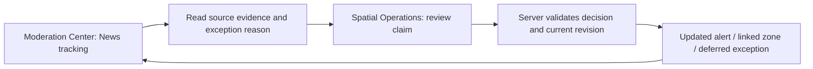

# Phase 36: Priority 5 Publication, Review, Corrections, Expiry and Frontend Plan

> **Last Updated:** October 02, 2026, 2:33 PM by [@roicambe](https://github.com/roicambe) (Roi Cambe)
> **Status:** Proposed plan after task-plan review. Implementation is paused at the developer's request. This document does not approve database changes or production activation.

## 1. Reviewed baseline and task order

Read the root `AGENTS.md`, `DESIGN.md`, `frontend/AGENTS.md`, documentation index, Phase 36 task plan, delivery records, relevant news/spatial/history plans and evaluations, screen/API/database references, and the senior-planner, UI, API, security and test skills under `.agents/skills/`. The frontend-specific rules require installed Next.js guides to be read before future code changes. Existing source was inspected to check integration points; no application code was changed for this plan.

| Priority | Recorded outcome | Remaining limitation |
| --- | --- | --- |
| 1: Retrieval | Accessible publisher bodies were retrieved; blocked/incomplete bodies have visible failure paths. | Successful live automatic alternate-body recovery is unverified. |
| 2: Discovery | Controlled discovery, time/update comparison and copied-body checks exist. | A fresh automatically discovered eligible incident and positive same-event matching remain unverified. |
| 3: Collection to extraction | Deployed immutable article inputs, leased rules processing and source-linked results; repeat processing creates no work. | This proves saved-body processing, not fresh incident discovery or public publication. |
| 4: Verified location matching connection | Deployed checksum-identified OSM placement evidence. A historical source span matches an 86.2 m centerline. | All 50 backlog placements are unresolved. A matched centerline does not verify current flooding, flooded width or routing closure geometry. |
| **5: Publication, exception review, corrections and expiry** | **Next planning priority; not implemented.** | Requires explicit publication decisions, durable lifecycle/audit/link identity and frontend/API contracts. |
| 6: Operational freshness/visibility | Existing feed and processing status are available to staff APIs. | Full latency, freshness, source health and scheduling assessment remains later work. Priority 5 must still surface its own errors and expiry. |

The six improvement priorities are different from recovery Gates 1–6. Priority 5 spans unfinished publication work in Gate 4, exception decisions in Gate 5, and release acceptance in Gate 6. It does not mark those gates complete.

The latest deployment evidence is in [the OSM processing evaluation](../evaluations/phase-36-reusable-road-match-check.md#production-release-verification). Older notes describing processing as disconnected are historical. [Activation safety](news-activation-safety-gates.md) governs writes; old confidence thresholds, arbitrary buffers and prototype test results cannot authorize publication.

## 2. Priority 5 lifecycle contract before screen implementation

The FastAPI backend owns eligibility, suppression, incident comparison, expiry, allowed actions and routing decisions. The frontend displays the returned decision and sends an explicit staff request; it does not promote extraction labels into public status.

| Outcome | Intended behavior | Routing effect |
| --- | --- | --- |
| Incomplete source or unresolved current-evidence prerequisites | Staff-only exception/lead with reason and retry information. | None |
| Credible recent source claim, affected segment unresolved | Automatically publish a source-labeled news alert after the separate alert policy passes. Missing map coverage alone does not veto a credible report. | None |
| Current claim with verified affected geometry and all activation gates | Create or link an expiring operational zone through the server-owned workflow. Record reported versus predicted placement. | Backend applies the existing vehicle-specific routing policy. |
| Conflicting evidence or ambiguous incident update | Retain evidence and require an exception decision; conservative handling of any existing linked state must be specified. | No automatic promotion or unrelated-zone removal. |
| Historical, forecast, negated or subsided claim | Preserve the evidence and reason. Do not publish it as a current flood alert or create a current closure. A matched later clearance can end existing state. | Only a verified update to the same linked incident can end its restriction. |
| Correction, withdrawal or expiry | Update public visibility and any linked operational state consistently, keeping source evidence and decision history. | Linked restriction must stop applying when withdrawn or expired. |

Publication visibility, extraction status, review state, placement precision and routing state are separate dimensions. An active source alert can coexist with unresolved placement; an expired alert does not prove a road is dry. A broad place must not be shown as an exact flood coordinate.

Before implementing writes, specify and test:

1. **Alert eligibility:** approved publisher or authenticated staff provenance, usable source evidence, non-forecast current flood status, location scope, explicit observation-time requirements, missing-time behavior and contradictory/caption-only evidence. Publication time and fetch time cannot substitute for observation time. A news alert may have unknown depth; zone gates remain stricter.
2. **Identity and revisions:** bind a decision to immutable article input, extraction run and claim evidence; define stable continuity across reruns and map refreshes. Deduplicate retries and copied/syndicated coverage without treating them as independent confirmation. Similar road names/titles cannot merge unrelated floods.
3. **Persistence:** assess existing tables for per-claim public state, decisions, versions, expiry, optimistic concurrency and links to reports/events/zones. Do not edit extraction results or feed metadata to hide mutable decisions. Produce exact schema/constraint and migration/backfill proposals if storage is insufficient; obtain separate developer approval before SQLAlchemy/Alembic edits.
4. **Atomicity and links:** verify publication, source report, event/zone links and audit history commit together. Inspect prototype helpers' internal commits before reusing them. A transaction failure or lost worker must not leave an orphan activation or report success. Account for the open Phase 33 origin/evidence-integrity work; do not invent evidence for existing orphan events.
5. **Corrections and clearance:** preserve original sentence/body, show the staff override separately, require actor/time/reason, retain public correction text separately from internal notes, reject outdated client revisions and match clearance to the same place/segment/incident. One source withdrawal must not end a zone still supported by other current evidence without an explicit policy.
6. **Expiry:** agree the news-alert and zone lifetimes and their time basis. The existing 12-hour activation freshness window is not an agreed alert TTL. Retries/re-fetches/map refreshes cannot extend lifetime. Exclude expired state from reads/routing even when maintenance is delayed; preserve audit history and end events only when their final live zone ends.
7. **Release:** stage the full path first. Production automatic routing activation requires the real-article safety evaluation and developer review already specified in recovery Gate 6.

## 3. Frontend plan grounded in existing navigation

Retain the existing feature-based frontend, persistent map and shared components. Add news-specific presentation/hooks under `src/features/news/`; use thin admin integrations under `src/features/admin/`. Existing source evidence screens, `Button`, `Tabs`, `Panel`, form controls, confirmation dialogs and shared map/camera utilities are reuse candidates. Avoid nested bordered cards and additional standalone moderation maps.

| Existing surface | Proposed addition | Responsibility |
| --- | --- | --- |
| `/admin/moderation` | **News** tab beside Community and Flood Reports | Track claim/publication states, inspect read-only evidence, filter exceptions, and hand off **Review on map**. Spatial decisions stay in Spatial Operations. |
| `/admin/map` | **News claims** list and contextual **Review news claim** workspace | Inspect candidate geometry against source details; correct, defer, reject, withdraw, or submit a gated confirmation. Preserve existing Create/Merge/Edit drafts and independent zone/report selections. |
| `/map` through persistent `GlobalMap` | **News alerts** entry and shared responsive panel | Read source-labeled active alerts and corrections without blocking route planning. Keep news geometry distinct from active-zone and modeled-NOAH layers. |
| Existing staff audit/history surfaces | Linked decision history and verified event/zone handoffs | Public alerts alone do not count as verified Flood Events in analytics. Withdrawn/expired claim history is not a recycle-bin deletion. |

Proposed staff journey:

These are proposed additions, not delivered routes or endpoints.

## 4. Staff screens and actions

**Tracking list:** default to exceptions needing attention, with separate filters for publication state, review reason, city/road, publisher and evidence date. Active automatic alerts, suppressed/historical claims, expired/withdrawn state and failed processing remain inspectable. Do not present `flagged_review` as synonymous with unpublished or extraction `completed` as approval. Include pagination, loading, empty, unavailable-source and explicit API failure states.

**Read-only evidence detail:** show publisher/title/source link, source sentence and surrounding relevant text, original extracted place/span, depth wording and supported physical measurements, condition, passability, publication time, observation time and unknowns. Show model/rule/map provenance and coverage limits in expandable staff detail. Do not show ranking as a percentage likelihood or present shared depth ranges as exact per-road values.

**Spatial review:** desktop keeps source details beside the persistent map and uses the existing contextual second pane. Mobile switches between Evidence and Map with the same selected claim and retained draft. Display multiple supported candidates with no initial selection; unmatched/unresolved claims retain their text and coverage reason. Candidate lines are labeled **Placement suggestion** and use a dedicated layer rather than the active-zone fill. Clicking a candidate does not establish flooding or activate it.

**Decision controls:** show only actions allowed by the server for the current revision. Proposed actions are Correct details, Defer, Reject claim, Withdraw alert, Confirm corrected claim, and Open linked zone. Separate alert confirmation from zone activation; the button and confirmation summary must state the exact public/routing effect. A selected OSM line or staff click cannot bypass missing current evidence or affected-geometry requirements. Require reasons for decisions and show public correction text separately from internal notes. Retain edits on request failure; show stale-version conflicts and reload/compare before resubmission. Pending writes disable duplicate submissions; an uncertain timeout requires reading durable outcome before retrying.

Preserve return-to-filtered-list navigation and repeat selection behavior. Opening a second claim must not silently replace unsaved review or existing Create/Merge/Edit drafts. Keep any saved drafts account-private using the established storage approach.

## 5. Commuter experience and responsive behavior

Recommended desktop entry: a collapsed **News alerts** control integrated with existing map controls; opening it uses the shared panel. It should not add a permanently expanded sidebar or overlap the route planner. Recommended mobile entry: the existing `+` menu opens a shared sheet, with an unobtrusive active-alert count if the server provides one. Opening the alert sheet coordinates with other panels rather than stacking them.

List items show reported place/city, publisher, condition, reported depth when available, explicit observation time or **Observation time unavailable**, and a readable freshness/status label. Details show source attribution/link, the supported excerpt, correction notice, expiry time and location precision. Display Philippine time consistently. Do not label publication time as observed time or claim unknown geometry is safe.

**News alert** means source-reported flooding; explanatory copy says **No routing restriction from this alert** when appropriate. For a linked zone, show **Routing restriction active** plus affected vehicle information supplied by the backend. Distinguish **Reported span** from **Predicted placement** when that future verified tier is enabled. Avoid copying internal pipeline IDs, checksums or staff notes into commuter cards.

Only evidence-supported display geometry gets a **View reported location** action. A bounded placement candidate can appear as a labeled line preview, not a flood-width polygon. A broad city/road or missing map coverage can remain text-only; do not invent a precise marker or close an entire road. Never reuse the NOAH scenario overlay as live evidence. The news preview source must not enter active-zone routing queries.

Use shared animations, keyboard focus/escape behavior, explicit Back actions, readable text and touch targets. Check 1440px desktop, 390px mobile, 320px narrow view and landscape; clear bottom navigation with `var(--bottom-nav-height)` plus safe-area insets. Preserve map viewport, route selection, 2D/3D mode and drafts through panel changes.

Public reads show only server-published fields. An error must not appear as **No flood alerts**. Offline/cached content is labeled stale and cannot imply a current restriction or fresh expiry decision; staff writes require connectivity and authoritative confirmation. SSE may invalidate/refetch state through the established mechanism, with reconnect/refetch fallback; no new WebSocket requirement. A withdrawn/expired selected alert must close or show its ended state on refresh, and a linked zone refresh must reach the routing/map consumers.

## 6. Proposed API contract requirements

Existing `/admin/news` endpoints provide feed/source/candidate data and extraction/processing reads, not a durable publication/review API. Do not implement a fake public lifecycle by directly rendering pending candidates.

Design staff list/detail/decision reads and writes, public active-alert/detail reads, and update notifications. Exact endpoint names and schemas remain proposals until lifecycle/storage design. Staff responses need source/version references, extraction and placement evidence, decision history, reasons, expiry, linked domain IDs, allowed actions and an expected revision token. Public responses need safe source identity/link, excerpt, reported place/time/depth qualifiers, public correction text, visibility state, location precision/display geometry and backend-calculated routing label/profile restrictions. Public schemas exclude internal notes and private evidence metadata.

All staff reads and writes enforce authenticated active staff roles in FastAPI before record lookup, plus bounded queries and rate limits. Reuse `apiClient` and TanStack Query; the backend controls scope, order, filters, counts, age gates and decisions. JWT handling stays consistent with the current PWA/WebView architecture. React escapes source text; no raw publisher HTML. Backend validates public source URLs and suppresses unsafe links.

## 7. Proposed delivery sequence and acceptance

1. Agree Priority 5 outcome/state/expiry/continuity and evidence contracts; finish the storage assessment and explicit migration proposal if required.
2. Agree frontend navigation and desktop/mobile wireframes using fixtures clearly marked preview-only. This planning stage is next; no implementation is currently authorized after the pause.
3. After implementation resumes, establish durable backend lifecycle and security/idempotency/concurrency tests in isolated PostGIS. Obtain schema approval before required model/migration work.
4. Build staff News tracking and Spatial Operations review first, using the contract; verify correction, conflict, rejection, deferral, withdrawal and shared-zone support behavior.
5. Build commuter alerts and distinct map presentation. Connect server-owned publication/expiry and SSE/refetch behavior. Keep automatic routing rollout gated separately.
6. Run controlled end-to-end cases and mobile/desktop review; document migration/release/rollback and independently approved production scope.

Acceptance must cover: credible unresolved-location alert without routing change; unresolved city/map coverage; bounded suggestion without false activation; multiple cities/claims; forecast/negation/historical/cleared evidence; unknown and stale time; shared/range depth; source revisions; retry/map-refresh/syndication duplicates; competing staff edits; transaction failure; public/internal-note privacy; 401/403 before evidence lookup; correction/withdrawal with other supporting sources; due expiry with delayed maintenance; final-zone event ending; offline stale data; reconnect; empty/error/loading states; narrow/mobile/PWA keyboard/safe-area behavior; and preservation of existing routing, hazard, Create/Merge/Edit and account-private drafts.

Historical GMA matching is a useful placement fixture, never a current public alert. The production backlog must not be published merely to populate the new frontend. Fresh live discovery acceptance remains separately open.

## 8. Decisions still to agree

- Adopt the proposed News tracking tab plus Spatial Operations decision workspace and collapsed commuter map entry.
- Set alert eligibility when depth is unknown, observation time is absent, or publisher context only establishes a broad place; decide whether missing-time claims remain exceptions (recommended initial policy).
- Agree alert/zone TTLs, newer clearance matching, and behavior when one of several supporting sources is withdrawn.
- Agree durable claim/incident identity and the exact schema proposal if existing storage is insufficient. Prior extraction-table approval does not authorize this schema.
- Review wireframes and public labels before coding. Automatic routing activation retains the separate measured-evidence release gate.
