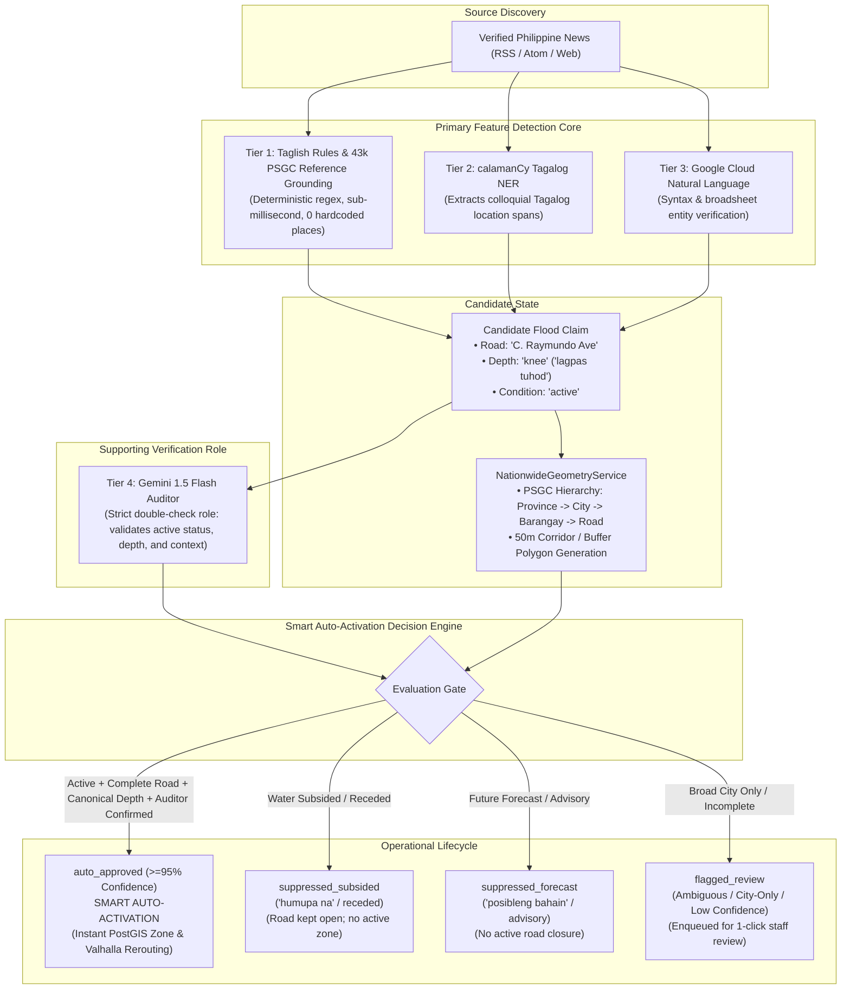

# LANES: Smart Auto-Activation & Multi-Tier Hybrid Flood Intelligence Plan

> **Author:** [@roicambe](https://github.com/roicambe) (Roi Cambe)  
> **Last Updated:** September 26, 2026, 3:30 AM  
> **Status:** Implemented & Verified (45/45 Tests Passing)  
> **Target Phase:** Capstone Phase 36 — Trusted Flood Intelligence

---

## 1. Executive Summary

This document specifies the technical architecture, execution flow, safety suppression mechanisms, and geometric standards for **Trusted Flood Intelligence** in the LANES platform. 

The system transitions from slow, manual administrator-only verification to an automated, intelligent ingestion pipeline (**Option 2: Smart Auto-Activation**). Complete flood reports from verified Philippine news sources are automatically converted into live Valhalla avoidance zones and official PostGIS flood events without admin bottleneck, while strict safety gates suppress receded waters (*"humupa na"*) and weather predictions (*"posibleng bahain"*) to prevent closing dry, passable roads.

---

## 2. Multi-Tier Hybrid Architecture (4-Tier AI Ensemble)

To prevent LLM hallucination, reduce API latency, and maintain academic defense rigor, the platform establishes an explicit division of labor: **deterministic rules and grounded NER lead detection, while Gemini 1.5 Flash acts strictly as a double-check auditor**.

### The 4 Tiers Defined

| Tier | Engine / Technology | Role in System | Performance / Cost |
|---|---|---|---|
| **Tier 1** | Local Deterministic Taglish Rules & PSA PSGC Grounding (`philippine_location_service.py`) | **Lead Extractor**: Scans text for flood verbs, canonical depths (`gutter`..`neck`), and matches place tokens against **43,778 official PSGC records**. Zero hardcoding in code files. | Sub-millisecond (<1ms), 0 MB cloud bandwidth, 100% deterministic. |
| **Tier 2** | `calamanCy` Tagalog NER Baseline (`tl_calamancy_md`) | **Local NER Assistant**: Identifies colloquial Tagalog location phrases and prepositional location heads (*sa kahabaan ng*, *sa kanto ng*). | Local CPU inference. |
| **Tier 3** | Google Cloud Natural Language API (`analyzeEntities`) | **Broadsheet Verifier**: Parses national broadsheet syntax, confirms entity salience, and verifies physical location entities. | Fast HTTP REST, 5,000 free monthly units. |
| **Tier 4** | Gemini 1.5 Flash (`audit_claim_with_llm`) | **Supporting Auditor**: Does **NOT** scan 4k text from scratch. Receives only the candidate claim and sentence. Answers: (1) Is it actively flooded right now? (2) Has water subsided? (3) Is it a weather forecast? (4) Does depth match? | Focused prompt, fast response (~300ms), prevents hallucination. |

---

## 3. Smart Auto-Activation Policy (Option 2)

### A. Automatic Approval Criteria (`auto_approved`)
A flood report is published directly to the live map and dynamic routing without waiting for administrator approval when **all five conditions** are met:
1. **Auditor Confirmation**: Gemini 1.5 Flash verifies the candidate claim (`is_confirmed = True`).
2. **Active Condition**: Condition is explicitly `"active"` or `"rising"` (not receded, not historical).
3. **Canonical Depth Gauge**: Flood depth maps to a standardized gauge (`gutter`, `half-knee`, `half-tire`, `knee`, `tires`, `waist`, `chest`, `neck`).
4. **Road or Landmark Precision**: Location resolves to an exact street segment or landmark (not just a broad city or province).
5. **High Consensus**: Combined multi-tier confidence score reaches **$\ge 95\%$ (0.95)**.

### B. Safety Suppression Gates (Zero False Road Closures)
- **Subsided Waters (`suppressed_subsided`)**: Reports containing *"humupa na"*, *"nag-subside"*, or *"muling nadaanan"* are strictly suppressed. Zero avoidance zones are created, ensuring clear roads remain open.
- **Weather Forecasts / Predictions (`suppressed_forecast`)**: Statements containing *"posibleng bahain"*, *"maaaring lumubog"*, or *"flood advisory"* are strictly suppressed. Predictions cannot close active roads.
- **Negated Reports (`suppressed_negated`)**: Reports confirming *"walang baha"* or *"passable sa lahat ng sasakyan"* are discarded.

### C. Moderation Queue Placement (`flagged_review`)
- Articles mentioning only a broad city (e.g., *"Binaha ang Iloilo City"*) without a specific street or barangay.
- Incomplete depth indicators.
- Discrepancies between primary rules and the auditor.
- Pre-rendered candidate geometry is attached in the dashboard for **1-click staff review and approval**.

---

## 4. Nationwide Location Ranking & Suggested Geometry

The [`NationwideGeometryService`](file:///d:/Documents/Github/LANES/backend/app/services/nationwide_geometry_service.py) transforms text mentions into authoritative PostGIS spatial barriers.

### Spatial Calculations
1. **Road Corridor Buffer (50m Polygon)**:
   For an exact road segment with midpoint coordinate $(\phi, \lambda)$:
   $$\Delta\phi = \frac{L}{2} \cdot \frac{\sin(\theta)}{111,139}, \quad \Delta\lambda = \frac{L}{2} \cdot \frac{\cos(\theta)}{111,139 \cdot \cos(\phi)}$$
   Generates a 4-corner corridor polygon (length $L = 120\text{ m}$, width $W = 40\text{ m}$) plus a central `LineString` representing the road centerline.
2. **Circular Point Buffer (50m Polygon)**:
   For landmarks or point coordinates, generates a regular 16-point circular approximation polygon (GeoJSON `Polygon`, SRID 4326):
   $$x_i = \lambda + \frac{R \cdot \cos(2\pi i / 16)}{111,139 \cdot \cos(\phi)}, \quad y_i = \phi + \frac{R \cdot \sin(2\pi i / 16)}{111,139}$$

### Hierarchical Precision Ranking

| Rank | Level | Criteria | Confidence | Action |
|---|---|---|:---:|---|
| **Rank 1** | Road Segment | Exact road corridor matched in verified city/barangay. | **0.90 – 0.99** | `auto_approved` (if depth & active present) |
| **Rank 2** | Specific Landmark | Resolved facility/landmark (e.g. market, hospital). | **0.85 – 0.88** | `auto_approved` (if depth & active present) |
| **Rank 3** | Barangay Area | Barangay boundary resolved; road centerline unmapped. | **0.65 – 0.70** | `flagged_review` (staff street selection) |
| **Rank 4** | City Only | Broad municipal mention without road/barangay. | **0.30 – 0.35** | `flagged_review` (prevents city shutdown) |
| **Rank 5** | Unresolved | Insufficient evidence to anchor coordinates. | **< 0.20** | `flagged_review` (manual geocoding needed) |

---

## 5. Persistence & Database Contract

- **Zero Schema Migrations Required**: Reuses established 3NF tables:
  - [`flood_reports`](file:///d:/Documents/Github/LANES/backend/app/models/report.py#L99): Stores raw evidence, canonical depth, and PostGIS geometry.
  - [`flood_events`](file:///d:/Documents/Github/LANES/backend/app/models/report.py#L64): Durable historical analytics record (`status = 'active'`).
  - [`flood_avoidance_zones`](file:///d:/Documents/Github/LANES/backend/app/models/report.py#L241): Operational 50m polygon barrier queried by Valhalla routing.
- **Idempotency**: Retried RSS articles or repeated URLs update `last_seen_at` without duplicating avoidance zones or inflating event counts.

---

## 6. Test Suite Matrix (100% Green)

| Test File | Tests | Coverage Scope | Status |
|---|:---:|---|:---:|
| [`test_hybrid_extraction_service.py`](file:///d:/Documents/Github/LANES/backend/tests/test_hybrid_extraction_service.py) | 6 | Rules mode, Gemini auditor confirmation, auto-approval ($\ge 95\%$), receded suppression, forecast suppression, offline fallback. | **PASSED** (0.45s) |
| [`test_nationwide_geometry.py`](file:///d:/Documents/Github/LANES/backend/tests/test_nationwide_geometry.py) | 7 | Closed-ring 50m polygons, corridor LineStrings, Luzon/Visayas/Mindanao roads, city-only safety guards, disambiguation. | **PASSED** (0.35s) |
| [`test_news_auto_ingestion.py`](file:///d:/Documents/Github/LANES/backend/tests/test_news_auto_ingestion.py) | 3 | Atomic event/zone creation without admin, zero zones for receded floods, zero zones for weather forecasts. | **PASSED** (0.47s) |
| [`test_philippine_location_service.py`](file:///d:/Documents/Github/LANES/backend/tests/test_philippine_location_service.py) | 6 | 43,778 PSGC record in-memory loading, alias normalization, hierarchical context disambiguation. | **PASSED** (0.24s) |
| [`test_taglish_extraction.py`](file:///d:/Documents/Github/LANES/backend/tests/test_taglish_extraction.py) | 11 | Canonical depth gauges, offset preservation, multi-location attribution, determinism. | **PASSED** (0.12s) |
| [`test_news_discovery.py`](file:///d:/Documents/Github/LANES/backend/tests/test_news_discovery.py) | 12 | RSS/Atom parsing, publisher domain allowlisting, deduplication, HTTP 304 checkpoints. | **PASSED** (0.26s) |
| **Total** | **45** | **Comprehensive Full Phase 36 Test Suite** | **45 / 45 PASSED** |
