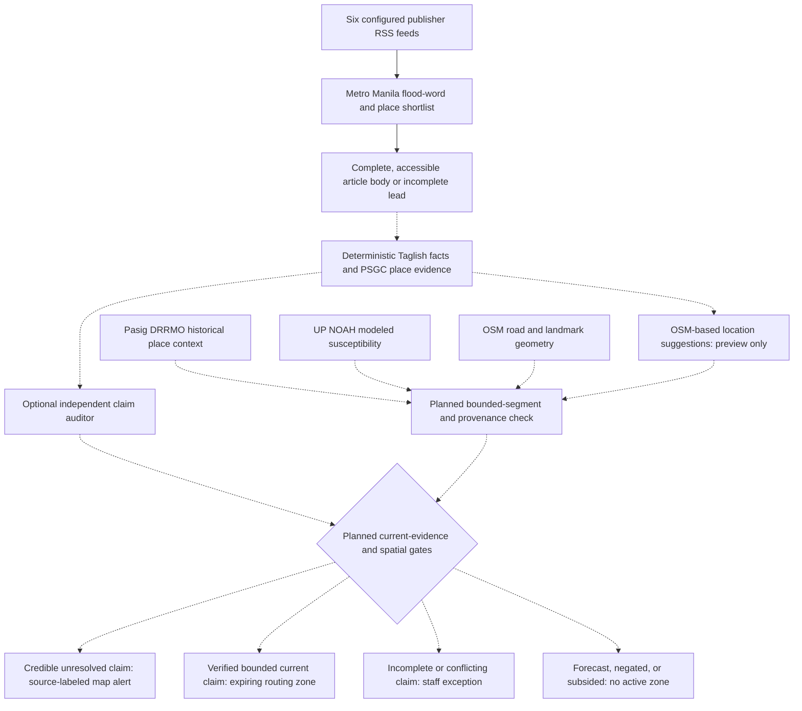

# LANES: Smart Auto-Activation & Multi-Tier Hybrid Flood Intelligence Plan

> **Author:** [@roicambe](https://github.com/roicambe) (Roi Cambe)  
> **Last Updated:** September 28, 2026, 10:30 PM
> **Status:** The scheduled RSS collector saves pending evidence. Connecting it to article extraction, current-evidence decisions, public alerts, and verified road zones remains open, as do exact road geometry and release verification. The historical 45/45 test result below predates the current safeguards.
> **Target Phase:** Capstone Phase 36 — Trusted Flood Intelligence

> **Current implementation note:** This document preserves the original Option 2 design. Separate backend services implement deterministic extraction and an optional Gemini auditor, but the scheduled RSS collector does not call them. calamanCy and Cloud Natural Language are not called. `0.95` is not a calibrated approval probability. The Pasig DRRMO CSV has historical street and depth context but no coordinates. LiPAD/UP NOAH layers are not integrated. Current polygons are previews and cannot make an exact road closure; see the [spatial integration](lipad-noah-flood-placement.md) and [activation safety](news-activation-safety-gates.md) plans. The ingestion code can auto-activate a fully evidenced claim, but the current geometry provider cannot produce the required verified segment. Credible news without exact segment geometry should reach commuters promptly as a separately labeled alert once that path is built.

---

## 1. Executive Summary

This document specifies the technical architecture, execution flow, safety suppression mechanisms, and geometric standards for **Trusted Flood Intelligence** in the LANES platform. 

The target system periodically checks approved RSS feeds for recent Metro Manila flood reports, extracts source-linked facts, and uses OSM road geometry with Pasig DRRMO history and LiPAD/UP NOAH hazard layers as location evidence. DRRMO records are historical context, and NOAH is modeled susceptibility; neither proves flooding now. Credible but imprecisely located reports should become source-labeled alerts. Only current claims with a verified bounded affected segment and all evidence gates may create an operational PostGIS zone that affects Valhalla routing. The collector currently stops after saving pending article evidence, and the spatial layers are not integrated into automatic placement.

---

## 2. Current Extraction and Planned Supporting Tiers

The current code uses deterministic rules and PSGC grounding. An optional configured OpenRouter Gemini auditor can check a candidate claim; missing or failed independent confirmation remains an exception. calamanCy and Google Cloud Natural Language are evaluation options, not runtime tiers. The diagram shows the intended connection between existing components and future spatial and publication gates.

```mermaid
flowchart TD
    RSS["Six configured publisher RSS feeds"] --> Shortlist["Metro Manila flood-word and place shortlist"]
    Shortlist --> Body["Complete, accessible article body or incomplete lead"]
    Body -.-> Facts["Deterministic Taglish facts and PSGC place evidence"]
    Facts -.-> Preview["OSM-based location suggestions: preview only"]
    Facts -.-> Audit["Optional independent claim auditor"]
    DRRMO["Pasig DRRMO historical place context"] -.-> Spatial["Planned bounded-segment and provenance check"]
    NOAH["UP NOAH modeled susceptibility"] -.-> Spatial
    OSM["OSM road and landmark geometry"] -.-> Spatial
    Preview -.-> Spatial
    Audit -.-> Gate{"Planned current-evidence and spatial gates"}
    Spatial -.-> Gate
    Gate -.-> Alert["Credible unresolved claim: source-labeled map alert"]
    Gate -.-> Zone["Verified bounded current claim: expiring routing zone"]
    Gate -.-> Review["Incomplete or conflicting claim: staff exception"]
    Gate -.-> Suppressed["Forecast, negated, or subsided: no active zone"]
```

### Implemented and Proposed Extractors

| Tier | Engine / Technology | Role in System | Performance / Cost |
|---|---|---|---|
| **Tier 1** | Local Deterministic Taglish Rules & PSA PSGC Grounding (`philippine_location_service.py`) | **Lead Extractor**: Scans text for flood verbs, canonical depths (`gutter`..`neck`), and matches place tokens against **43,778 official PSGC records**. Zero hardcoding in code files. | Sub-millisecond (<1ms), 0 MB cloud bandwidth, 100% deterministic. |
| **Tier 2, planned evaluation** | `calamanCy` Tagalog NER | Test whether it improves difficult Taglish place extraction on labeled Metro Manila articles before integrating it. | Not installed or called by the runtime. |
| **Tier 3, planned evaluation** | Google Cloud Natural Language API | Compare only if the labeled evaluation identifies a measurable need. | Not called by the runtime. |
| **Supporting auditor prototype** | Configured OpenRouter Gemini model (`audit_claim_with_llm`) | Checks the candidate claim and evidence sentence; failure or missing credentials do not confirm a claim. | Optional; not connected to scheduled RSS processing. |

---

## 3. Smart Auto-Activation Policy (Option 2)

### A. Automatic Approval Criteria (`auto_approved`)
A future claim may publish a routing-affecting zone without routine administrator approval only when **all** requirements in the [activation safety contract](news-activation-safety-gates.md) pass: complete traceable source text, a recent resolved flood observation time, active status, justified depth, independent confirmation, and a checked bounded affected road segment or landmark footprint with provenance. The persistence path must recheck those facts, handle contradictions and duplicates, and assign expiry. A place-ranking score is not a calibrated probability or an approval threshold. These requirements are not yet satisfied by the scheduled collector.

### B. Safety Suppression Gates (Target Behavior)
- **Subsided Waters (`suppressed_subsided`)**: Reports containing *"humupa na"*, *"nag-subside"*, or *"muling nadaanan"* must not create a current avoidance zone. Contradictory updates require review; real-article validation remains open.
- **Weather Forecasts / Predictions (`suppressed_forecast`)**: Statements containing *"posibleng bahain"*, *"maaaring lumubog"*, or *"flood advisory"* are strictly suppressed. Predictions cannot close active roads.
- **Negated Reports (`suppressed_negated`)**: Explicit *"walang baha"* statements must not create a current flood zone. A passable road may still have floodwater, so passability and flood presence remain separate facts.

### C. Moderation Queue Placement (`flagged_review`)
- Articles mentioning only a broad city (e.g., *"Binaha ang Iloilo City"*) without a specific street or barangay.
- Incomplete depth indicators.
- Discrepancies between primary rules and the auditor.
- Preview geometry can support the planned staff exception review, but the dedicated claim review dashboard is not implemented.

---

## 4. Metro Manila Location Ranking & Suggested Geometry

The [`NationwideGeometryService`](file:///d:/Documents/Github/LANES/backend/app/services/nationwide_geometry_service.py) generates location suggestions and preview polygons. It does not verify a reported flooded road segment or create an authoritative PostGIS barrier.

### Spatial Calculations
1. **Road Corridor Buffer (50m Polygon)**:
   For an exact road segment with midpoint coordinate $(\phi, \lambda)$:
   $$\Delta\phi = \frac{L}{2} \cdot \frac{\sin(\theta)}{111,139}, \quad \Delta\lambda = \frac{L}{2} \cdot \frac{\cos(\theta)}{111,139 \cdot \cos(\phi)}$$
   Generates a 4-corner corridor polygon (length $L = 120\text{ m}$, width $W = 40\text{ m}$) plus a central `LineString` representing the road centerline.
2. **Circular Point Buffer (50m Polygon)**:
   For landmarks or point coordinates, generates a regular 16-point circular approximation polygon (GeoJSON `Polygon`, SRID 4326):
   $$x_i = \lambda + \frac{R \cdot \cos(2\pi i / 16)}{111,139 \cdot \cos(\phi)}, \quad y_i = \phi + \frac{R \cdot \sin(2\pi i / 16)}{111,139}$$

### Hierarchical Precision Ranking

| Rank | Place evidence | Suggested handling |
|---|---|---|
| **1** | Article names a road plus cross streets or an explicit span, grounded in the correct city and, when given, barangay. | Check the bounded routable segment against the report; only a separately verified current claim can affect routing. |
| **2** | Article names a landmark with a checked footprint and city context. | Keep as a location suggestion until the affected footprint is independently verified. |
| **3** | Article names a road or barangay but no bounded affected section. | Show a source-labeled alert at defensible precision; do not close an entire road. |
| **4** | Article names only a broad city or has unresolved place evidence. | Keep as an incomplete lead or staff exception; do not create a route-affecting zone. |

---

## 5. Persistence & Database Contract

- **Existing domain tables:** The prototype can reuse established `flood_reports`, `flood_events`, and `flood_avoidance_zones` for an operational zone once evidence is verified. Durable per-claim evidence, alert state, corrections, and idempotency still need a schema assessment before Gate 4; no new model or migration is authorized by this plan.
  - [`flood_reports`](file:///d:/Documents/Github/LANES/backend/app/models/report.py#L99): Stores raw evidence, canonical depth, and PostGIS geometry. Dynamic `@property` getters compute `depth_meters`, `depth_inches`, and `depth_formatted` adhering strictly to 3NF.
  - [`flood_events`](file:///d:/Documents/Github/LANES/backend/app/models/report.py#L64): Durable historical analytics record (`status = 'active'`) exposing computed peak depth measurements.
  - [`flood_avoidance_zones`](file:///d:/Documents/Github/LANES/backend/app/models/report.py#L241): Operational 50m polygon barrier queried by Valhalla routing, exposing computed depth measurements in contributor metadata.
- **Idempotency target:** Re-fetches, Scheduler retries, and syndicated copies must not duplicate public alerts or avoidance zones. This is not yet verified end to end.

---

## 6. Historical Test Baseline (September 2026)

The 45/45 result below records an earlier unit-test run of separate prototypes. It is not an RSS-to-map integration test, a current test-suite result, or evidence of safe automatic activation. The former `0.95` test checked a heuristic that the current safety gate no longer treats as an approval probability.

| Test File | Tests | Coverage Scope | Status |
|---|:---:|---|:---:|
| [`test_hybrid_extraction_service.py`](file:///d:/Documents/Github/LANES/backend/tests/test_hybrid_extraction_service.py) | 6 | Rules mode, Gemini auditor confirmation, auto-approval ($\ge 95\%$), receded suppression, forecast suppression, offline fallback. | **PASSED** (0.45s) |
| [`test_nationwide_geometry.py`](file:///d:/Documents/Github/LANES/backend/tests/test_nationwide_geometry.py) | 7 | Closed-ring 50m polygons, corridor LineStrings, Luzon/Visayas/Mindanao roads, city-only safety guards, disambiguation. | **PASSED** (0.35s) |
| [`test_news_auto_ingestion.py`](file:///d:/Documents/Github/LANES/backend/tests/test_news_auto_ingestion.py) | 3 | Atomic event/zone creation without admin, zero zones for receded floods, zero zones for weather forecasts. | **PASSED** (0.47s) |
| [`test_philippine_location_service.py`](file:///d:/Documents/Github/LANES/backend/tests/test_philippine_location_service.py) | 6 | 43,778 PSGC record in-memory loading, alias normalization, hierarchical context disambiguation. | **PASSED** (0.24s) |
| [`test_taglish_extraction.py`](file:///d:/Documents/Github/LANES/backend/tests/test_taglish_extraction.py) | 11 | Canonical depth gauges, offset preservation, multi-location attribution, determinism. | **PASSED** (0.12s) |
| [`test_news_discovery.py`](file:///d:/Documents/Github/LANES/backend/tests/test_news_discovery.py) | 12 | RSS/Atom parsing, publisher domain allowlisting, deduplication, HTTP 304 checkpoints. | **PASSED** (0.26s) |
| **Total** | **45** | **Historical prototype tests only** | **45 / 45 PASSED at that checkpoint** |
