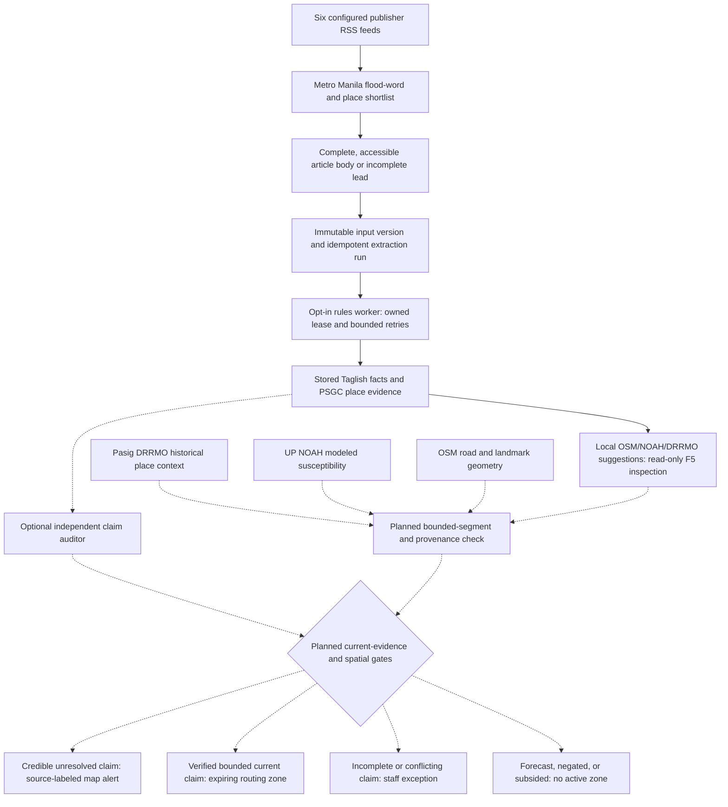

# LANES: Smart Auto-Activation & Multi-Tier Hybrid Flood Intelligence Plan

> **Author:** [@roicambe](https://github.com/roicambe) (Roi Cambe)  
> **Last Updated:** October 04, 2026, 3:24 PM by [@roicambe](https://github.com/roicambe) (Roi Cambe)
> **Status:** Priorities 3/4 have recorded production extraction/OSM verification; local v10 attaches exact NOAH vector overlap and section-matched Pasig DRRMO evidence. Priority 5 F5 source/placement inspection is locally implemented; implementation is no longer paused. Independent audit, verified operational geometry, durable news decisions/publication/correction/expiry, F7 commuter visibility and F8 release acceptance remain open. Older prototype/pre-release results below are historical evidence. See the [current frontend plan](news-publication-review-frontend-plan.md).
> **Target Phase:** Capstone Phase 36 — Trusted Flood Intelligence

> **Current implementation note:** shared saved/RSS processing invokes rules-only extraction, OSM candidate resolution and local NOAH/DRRMO placement preview. It does not invoke the optional external auditor or `NewsAutoIngestionService`. F5 inspects source evidence and alternatives without public writes. calamanCy and Cloud Natural Language remain unused; `0.95` is not an approval probability. A centerline or NOAH/DRRMO ranking does not verify current flooded width. [Readiness assessment](news-publication-readiness-plan.md) is complete with a five-table proposal; schema/expiry approval and operational geometry/assets remain pending. Auditor provider/context defects are reproduced offline, not fixed. Production was last documented as v4; local v9 corrections and v10 previews are not a release claim. [Assessment evidence](../evaluations/phase-36-publication-readiness-audit.md), [activation gates](news-activation-safety-gates.md).

---

## 1. Executive Summary

This document specifies the technical architecture, execution flow, safety suppression mechanisms, and geometric standards for **Trusted Flood Intelligence** in the LANES platform. 

The product target is nationwide Philippines flood intelligence; current collection and analytical road/hazard coverage are Metro Manila. The system captures source-linked facts, ranks bounded OSM sections using exact NOAH vectors and matching Pasig-only DRRMO history, and locally presents those read-only suggestions in F5. Historical data and modeled susceptibility do not prove current flooding. Credible unresolved claims should become source-labeled alerts once the lifecycle is built; routing zones additionally require verified affected geometry and all evidence gates. Automatic alert/zone publication, independent audit, correction and expiry remain unfinished.

---

## 2. Current Extraction and Planned Supporting Tiers

The current code uses deterministic rules and PSGC grounding. An optional configured OpenRouter Gemini auditor can check a candidate claim; missing or failed independent confirmation remains an exception. calamanCy and Google Cloud Natural Language are evaluation options, not runtime tiers. The diagram shows the intended connection between existing components and future spatial and publication gates.

```mermaid
flowchart TD
    RSS["Six configured publisher RSS feeds"] --> Shortlist["Metro Manila flood-word and place shortlist"]
    Shortlist --> Body["Complete, accessible article body or incomplete lead"]
    Body --> Inputs["Immutable input version and idempotent extraction run"]
    Inputs --> Worker["Opt-in rules worker: owned lease and bounded retries"]
    Worker --> Facts["Stored Taglish facts and PSGC place evidence"]
    Facts --> Preview["Local OSM/NOAH/DRRMO suggestions: read-only F5 inspection"]
    Facts -.-> Audit["Optional independent claim auditor"]
    DRRMO["Pasig DRRMO historical place context"] -.-> Spatial["Planned bounded-segment and provenance check"]
    NOAH["UP NOAH modeled susceptibility"] -.-> Spatial
    OSM["OSM road and landmark geometry"] -.-> Spatial
    Preview -.-> Spatial
    Audit -.-> Gate{"Planned current-evidence and spatial gates"}
    Spatial -.-> Gate
    Gate -.-> Alert["Credible unresolved claim: source-labeled map alert"]
    Gate -.-> Zone["Verified bounded current claim: expiring routing zone"]
    Gate -.-> Review["Incomplete or conflicting claim: staff exception"]
    Gate -.-> Suppressed["Forecast, negated, or subsided: no active zone"]
```

### Implemented and Proposed Extractors

| Tier | Engine / Technology | Role in System | Performance / Cost |
|---|---|---|---|
| **Tier 1** | Local Deterministic Taglish Rules & PSA PSGC Grounding (`philippine_location_service.py`) | **Lead Extractor**: Scans text for flood verbs, canonical depths (`gutter`..`neck`), and matches place tokens against **43,778 official PSGC records**. Zero hardcoding in code files. | Sub-millisecond (<1ms), 0 MB cloud bandwidth, 100% deterministic. |
| **Tier 2, planned evaluation** | `calamanCy` Tagalog NER | Test whether it improves difficult Taglish place extraction on labeled Metro Manila articles before integrating it. | Not installed or called by the runtime. |
| **Tier 3, planned evaluation** | Google Cloud Natural Language API | Compare only if the labeled evaluation identifies a measurable need. | Not called by the runtime. |
| **Supporting auditor prototype** | Configured OpenRouter Gemini model (`audit_claim_with_llm`) | Checks the candidate claim and evidence sentence; failure or missing credentials do not confirm a claim. | Optional; not connected to scheduled RSS processing. |

---

## 3. Smart Auto-Activation Policy (Option 2)

### A. Automatic Approval Criteria (`auto_approved`)
A future claim may publish a routing-affecting zone without routine administrator approval only when **all** requirements in the [activation safety contract](news-activation-safety-gates.md) pass: complete traceable source text, a recent resolved flood observation time, active status, justified depth, independent confirmation, and a checked bounded affected road segment or landmark footprint with provenance. The persistence path must recheck those facts, handle contradictions and duplicates, and assign expiry. A place-ranking score is not a calibrated probability or an approval threshold. These requirements are not yet satisfied by the scheduled collector.

### B. Safety Suppression Gates (Target Behavior)
- **Subsided Waters (`suppressed_subsided`)**: Reports containing *"humupa na"*, *"nag-subside"*, or *"muling nadaanan"* must not create a current avoidance zone. Contradictory updates require review; real-article validation remains open.
- **Weather Forecasts / Predictions (`suppressed_forecast`)**: Statements containing *"posibleng bahain"*, *"maaaring lumubog"*, or *"flood advisory"* are strictly suppressed. Predictions cannot close active roads.
- **Negated Reports (`suppressed_negated`)**: Explicit *"walang baha"* statements must not create a current flood zone. A passable road may still have floodwater, so passability and flood presence remain separate facts.

### C. Moderation Queue Placement (`flagged_review`)
- Articles mentioning only a broad city (e.g., *"Binaha ang Iloilo City"*) without a specific street or barangay.
- Incomplete depth indicators.
- Discrepancies between primary rules and the auditor.
- Preview geometry can support the planned staff exception review, but the dedicated claim review dashboard is not implemented.

---

## 4. Metro Manila Location Ranking & Suggested Geometry

The [`NationwideGeometryService`](file:///d:/Documents/Github/LANES/backend/app/services/nationwide_geometry_service.py) generates location suggestions and preview polygons. It does not verify a reported flooded road segment or create an authoritative PostGIS barrier.

### Spatial Calculations
1. **Road Corridor Buffer (50m Polygon)**:
   For an exact road segment with midpoint coordinate $(\phi, \lambda)$:
   $$\Delta\phi = \frac{L}{2} \cdot \frac{\sin(\theta)}{111,139}, \quad \Delta\lambda = \frac{L}{2} \cdot \frac{\cos(\theta)}{111,139 \cdot \cos(\phi)}$$
   Generates a 4-corner corridor polygon (length $L = 120\text{ m}$, width $W = 40\text{ m}$) plus a central `LineString` representing the road centerline.
2. **Circular Point Buffer (50m Polygon)**:
   For landmarks or point coordinates, generates a regular 16-point circular approximation polygon (GeoJSON `Polygon`, SRID 4326):
   $$x_i = \lambda + \frac{R \cdot \cos(2\pi i / 16)}{111,139 \cdot \cos(\phi)}, \quad y_i = \phi + \frac{R \cdot \sin(2\pi i / 16)}{111,139}$$

### Hierarchical Precision Ranking

| Rank | Place evidence | Suggested handling |
|---|---|---|
| **1** | Article names a road plus cross streets or an explicit span, grounded in the correct city and, when given, barangay. | Check the bounded routable segment against the report; only a separately verified current claim can affect routing. |
| **2** | Article names a landmark with a checked footprint and city context. | Keep as a location suggestion until the affected footprint is independently verified. |
| **3** | Article names a road or barangay but no bounded affected section. | Show a source-labeled alert at defensible precision; do not close an entire road. |
| **4** | Article names only a broad city or has unresolved place evidence. | Keep as an incomplete lead or staff exception; do not create a route-affecting zone. |

---

## 5. Persistence & Database Contract

### Priority 3 extraction handoff — October 2 approved implementation

**Approved and implemented locally:** After the next-task explanation identified the required two tables, the developer replied “okay proceed.” The additive migration, durable worker, staff processing APIs, and collector options below are implemented. Priority 2 live positive matching remains open; this authorization advances separate persistence work without claiming that acceptance passed. Production release remains pending.

**Delivered locally:** Saved pending `NewsArticle` rows can enter the same rules-only extraction function as the RSS dry run, retaining their real article IDs, original publication times, source URLs, and deterministic input fingerprints. `GET /api/v1/admin/news/candidates/{article_id}/extraction` is a staff-only, rate-limited preview; `python -m scripts.run_news_discovery --extract-saved --dry-run --limit 50` previews up to 200 pending saved articles. Missing/errored/oversized bodies and per-article processing failures remain visible. Previewing neither stores results nor changes review state, calls an external auditor, or invokes zone ingestion. These previews prepare the worker input/output contract; the scheduled collector still does not invoke extraction.

**Why storage is needed:** The three deployed news tables retain articles and feed provenance. They cannot preserve extraction artifacts, earlier article bodies after successful revisions, attempt ownership, or due processing retries. `news_article_feed_entries.raw_metadata` is feed provenance and must not become a hidden processing store; `review_state` is a review outcome and must not become a processing lease. A process-local cache or stdout output cannot establish durable completion.

**Approved additive migration `f29b6c8d104e` — development-verified, not deployed:**

| New table | Implemented fields and constraints | Purpose |
|---|---|---|
| `news_article_versions` | Integer `id`; indexed `article_id` FK to `news_articles` with RESTRICT deletion; SHA-256 `input_fingerprint`; immutable JSONB `input_snapshot`; UTC `created_at`; unique `(article_id, input_fingerprint)` | Preserve the exact source input before mutable article revisions replace it. |
| `news_extraction_runs` | Integer `id`; indexed `article_version_id` FK to versions with RESTRICT deletion; `pipeline_version`; `mode` initially constrained to `rules_only`; processing `status` (`pending`, `processing`, `completed`, `retry_wait`, `failed`); `attempt_count` default 0; nullable UTC `next_attempt_at`, `lease_expires_at`, `started_at`, `completed_at`; nullable UUID `lease_token`; nullable bounded `error_code`; nullable JSONB `result`; UTC `created_at`, `updated_at`; unique `(article_version_id, pipeline_version, mode)`; index `(status, next_attempt_at, lease_expires_at)` | Retain versioned per-claim extraction output and retry/lease state independently of moderation. |

The immutable input snapshot contains the exact canonical URL, publisher key, title, excerpt, full article body, and original publication timestamp. The implemented fingerprint hashes canonical UTF-8 JSON with sorted keys and UTC-normalized publication time, excluding article ID and fetch time; unchanged evidence fetched later does not become a new version. Snapshot fields are historical source evidence, not a second mutable publisher registry. Extraction `result` is a versioned unstructured artifact conforming to `NewsExtractionResult`, including per-claim evidence spans, depth/status/observation time, rules, uncertainty, and preview geometry provenance. No extracted geometry becomes operational because it is saved.

**Implemented worker contract:**

1. Within article persistence transactions, preserve successful prior/current inputs as immutable versions and enqueue a rules-only run once per version/pipeline. Blocked or incomplete bodies do not create successful extraction runs. Successful revisions remain separate versions. Initially process current pending RSS and manual candidates; do not backfill archived/approved history automatically.
2. Select due work independently of RSS ETag/304 results. Use short PostgreSQL row-lock transactions with `FOR UPDATE SKIP LOCKED`, a fresh lease token, and a five-minute lease. Close the claiming transaction before CPU extraction. Every completion update must match its lease token, preventing an expired worker from overwriting another attempt.
3. Call the shared extractor using the immutable snapshot, the real article ID, and `rules_only`; retain the full typed result and input/pipeline identity. Check processing errors before marking `completed`; an empty valid claim list is a successful extraction, not a current-flood claim. Unknown or historical observation time cannot authorize activation.
4. On retryable processing failure, record a safe error code and schedule exponential 60/120/240/480-second delays, stopping after five attempts. Expired leases are recoverable within that attempt bound; surface exhausted/permanent errors to staff/logs. Never sleep through long retry delays inside API requests. Publisher retrieval retries and GDELT distributed pacing are separate future work; this queue handles extraction of captured bodies.
5. Completed jobs are skipped on reruns and restart. A changed input or intentionally bumped pipeline version creates new work. Changing extractor/PSGC/geometry policy must bump `pipeline_version`; hash identity does not verify incident continuity or independent sources.
6. The collector supports `--discover --process --limit 50` and independent `--process-saved --limit 50` (maximum 200). Staff can inspect `GET /api/v1/admin/news/candidates/{article_id}/processing` or invoke rate-limited `POST` on that path (3/minute). First integration stores facts and processing outcomes without calling `NewsAutoIngestionService`, creating public alerts, or touching Flood Report/Event/Zone tables. Keep the deployed job configuration unchanged until release verification.

**Acceptance before rollout:** Apply/rollback/apply the approved migration in development PostGIS; test unchanged bodies, new bodies/publication revisions, manual inputs, blocked refreshes, two workers, repeated Scheduler delivery, expired leases, retries/exhaustion, empty claims, source snapshot integrity, and per-article errors. Verify zero public report/event/zone writes, no external auditor calls, and stable existing moderation state. Feed checkpoints remain collection state. Staff routes retain authentication and rate limits. Instance restart and a 304 feed response must not lose previously captured extraction work.

**Verification and rollout:** Seventeen focused worker/API tests and four real PostgreSQL integrity/concurrency tests passed. Full migration apply/rollback/apply succeeded on an isolated disposable database on the existing Cloud SQL instance; production was untouched and the disposable database deleted. The database also enforces version immutability with a BEFORE UPDATE trigger. Apply the migration before deploying this revision, then enable processing and verify a real collected body and restart delivery. Incident grouping, corroboration, alerts, and existing-zone updates remain later contracts. Owner: [@roicambe](https://github.com/roicambe) (Roi Cambe).

- **Existing domain tables:** The prototype can reuse established `flood_reports`, `flood_events`, and `flood_avoidance_zones` for an operational zone once evidence is verified. Durable per-claim evidence, alert state, corrections, and idempotency still need a schema assessment before Gate 4; the two approved extraction tables do not authorize changes to public domain models.
  - [`flood_reports`](file:///d:/Documents/Github/LANES/backend/app/models/report.py#L99): Stores raw evidence, canonical depth, and PostGIS geometry. Dynamic `@property` getters compute `depth_meters`, `depth_inches`, and `depth_formatted` adhering strictly to 3NF.
  - [`flood_events`](file:///d:/Documents/Github/LANES/backend/app/models/report.py#L64): Durable historical analytics record (`status = 'active'`) exposing computed peak depth measurements.
  - [`flood_avoidance_zones`](file:///d:/Documents/Github/LANES/backend/app/models/report.py#L241): Operational 50m polygon barrier queried by Valhalla routing, exposing computed depth measurements in contributor metadata.
- **Idempotency target:** Re-fetches, Scheduler retries, and syndicated copies must not duplicate public alerts or avoidance zones. This is not yet verified end to end.

---

## 6. Historical Test Baseline (September 2026)

The 45/45 result below records an earlier unit-test run of separate prototypes. It is not an RSS-to-map integration test, a current test-suite result, or evidence of safe automatic activation. The former `0.95` test checked a heuristic that the current safety gate no longer treats as an approval probability.

| Test File | Tests | Coverage Scope | Status |
|---|:---:|---|:---:|
| [`test_hybrid_extraction_service.py`](file:///d:/Documents/Github/LANES/backend/tests/test_hybrid_extraction_service.py) | 6 | Rules mode, Gemini auditor confirmation, auto-approval ($\ge 95\%$), receded suppression, forecast suppression, offline fallback. | **PASSED** (0.45s) |
| [`test_nationwide_geometry.py`](file:///d:/Documents/Github/LANES/backend/tests/test_nationwide_geometry.py) | 7 | Closed-ring 50m polygons, corridor LineStrings, Luzon/Visayas/Mindanao roads, city-only safety guards, disambiguation. | **PASSED** (0.35s) |
| [`test_news_auto_ingestion.py`](file:///d:/Documents/Github/LANES/backend/tests/test_news_auto_ingestion.py) | 3 | Atomic event/zone creation without admin, zero zones for receded floods, zero zones for weather forecasts. | **PASSED** (0.47s) |
| [`test_philippine_location_service.py`](file:///d:/Documents/Github/LANES/backend/tests/test_philippine_location_service.py) | 6 | 43,778 PSGC record in-memory loading, alias normalization, hierarchical context disambiguation. | **PASSED** (0.24s) |
| [`test_taglish_extraction.py`](file:///d:/Documents/Github/LANES/backend/tests/test_taglish_extraction.py) | 11 | Canonical depth gauges, offset preservation, multi-location attribution, determinism. | **PASSED** (0.12s) |
| [`test_news_discovery.py`](file:///d:/Documents/Github/LANES/backend/tests/test_news_discovery.py) | 12 | RSS/Atom parsing, publisher domain allowlisting, deduplication, HTTP 304 checkpoints. | **PASSED** (0.26s) |
| **Total** | **45** | **Historical prototype tests only** | **45 / 45 PASSED at that checkpoint** |
